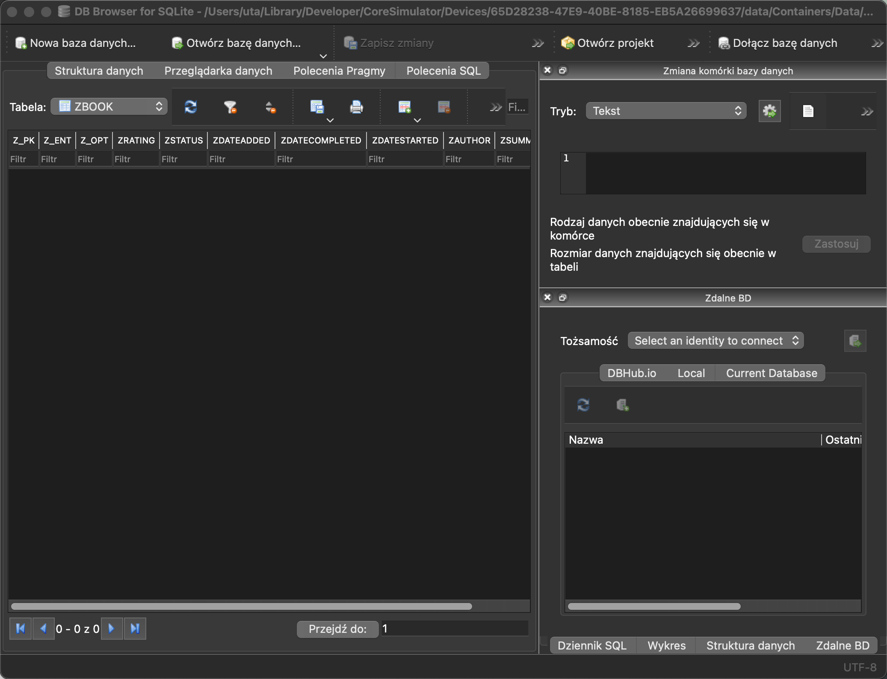
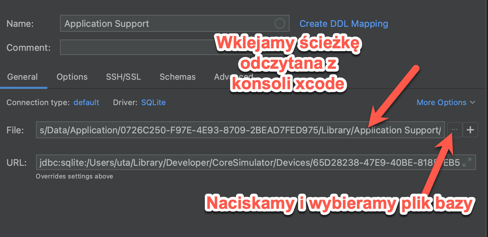
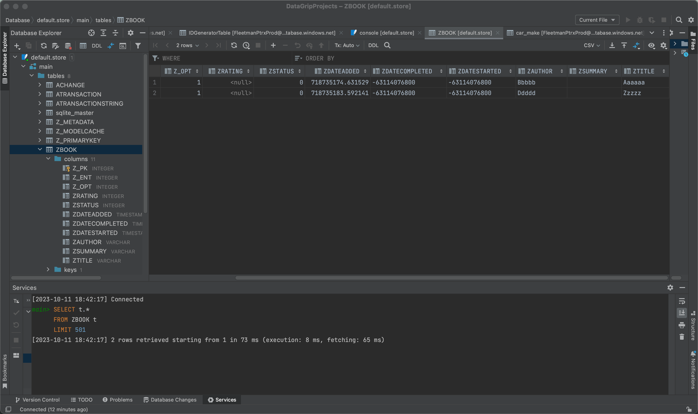

# My Books

Aplikacja korzystająca z Swift Data. W pierwszym zestawie trzech filmów będziemy tworzyć aplikację do śledzenia książek, które albo umieściliśmy na półce, albo aktualnie czytamy, albo już przeczytaliśmy. Ten film będzie najdłuższy w tej serii, wprowadzę was do operacji CRUD, czyli tworzenia, odczytu, aktualizacji i usuwania rekordów, oraz jak je trwale przechowywać w bazie danych SQLite na urządzeniu. W kolejnych sekcjach po tym filmie rozwiniemy tę aplikację i przedstawię wam relacje, takie jak relacje jeden-do-wielu oraz wiele-do-wielu. Będziemy nawet zagłębiać się w lokalizację i CloudKit.  Chcemy stworzyć aplikację na iPhone'a, która pozwoli nam dodawać i śledzić książki, które zdobyliśmy i które czekają na przeczytanie, są w trakcie czytania lub zostały już przeczytane. Możemy także chcieć dodać podsumowanie książki lub nawet ocenę. Zaczynajmy więc od utworzenia nowej aplikacji teraz w Xcode i nazwiemy ją "Moje Książki". Moglibyśmy wybrać SwiftData jako opcję przechowywania danych, ale to spowodowałoby konieczność zmiany wielu podstawowych fragmentów kodu, a poza tym z SwiftData bardzo łatwo ręcznie tworzyć nasze modele danych i przechowywać je. Zaczniemy od utworzenia modelu dla naszej książki. Kiedy tworzę nowy wpis, chcę po prostu dodać tytuł i autora, dlatego ustalimy domyślne wartości dla pozostałych właściwości, ale o tym jeszcze porozmawiam. Zacznijmy więc od utworzenia pliku Swift o nazwie "Book". Wewnątrz utworzymy klasę o nazwie "Book" i dodamy kilka właściwości. Będziemy potrzebowali tytułu i autora, oba będą typu String. Chcę śledzić datę dodania książki, datę rozpoczęcia jej czytania i datę jej zakończenia.

Wszystkie te właściwości będą typu daty, i możesz pomyśleć, że właściwości `started` i `completed` powinny być opcjonalne. Ale uważam, że ponieważ zamierzam użyć pickera, łatwiej jest ustawić wartość domyślną, o czym niedługo zobaczysz. Dla podsumowania stworzę właściwość typu String, a dla oceny utworzę opcjonalną wartość całkowitą (`Int`). 

```swift
class Book {
    var title: String
    var author: String
    var dateAdded: Date
    var dateStarted: Date
    var dateCompleted: Date
    var summary: String
    var rating: Int?
}
```


Aby śledzić status naszej książki, stworzę enuma dla tej właściwości i nazwę go `status`. Utworzę go tutaj, w tym samym pliku. Zdefiniuję go jako Int, ale dla Swift Data musimy upewnić się, że jest Codable. Chcę również używać go w pickerze, więc musi być identyfikowalny (`Identifiable`). Jeśli użyję case iterable, będę mógł iterować przez wszystkie różne przypadki. Trzy przypadki, które chcę obejmować, to `onShelf`, `inProgress` i `completed`.

```swift
enum Status: Int, Codable, Identifiable, CaseIterable {
  case onShelf,inProgress, completed
}
```

 Aby spełnić protokół `Identifiable`, mogę utworzyć obliczoną właściwość `id` typu `Self`, która po prostu zwróci `self`. 

```swift
    var id: Self {
        self
    }
```

Teraz picker będzie potrzebować pewnego tekstu do wyświetlenia dla każdego przypadku. Utworzę więc kolejną obliczoną właściwość, którą nazwę `description` , która będzie typu String. Użyję instrukcji switch na `self` i dla każdego przypadku zwrócę tekstową reprezentację tego przypadku. Tak więc OnShelf, InProgress lub Completed. Teraz mogę dodać właściwość `status` do naszej klasy, która będzie miała ten typ `status`. 

```swift
    var description: String {
        switch self {

        case .onShelf:
            "On Shelf"
        case .inProgress:
            "In Progress"
        case .completed:
            "Completed"
        }
    }
```

Następnie, ponieważ używam klasy, będę potrzebować inicjalizatora. Pozwól, że zaznaczę parametry 

```swift
    init(
        title: String,
        author: String,
        dateAdded: Date,
        dateStarted: Date,
        dateCompleted: Date,
        summary: String,
        rating: Int? = nil,
        status: Status
    ) {
        self.title = title
        self.author = author
        self.dateAdded = dateAdded
        self.dateStarted = dateStarted
        self.dateCompleted = dateCompleted
        self.summary = summary
        self.rating = rating
        self.status = status
    }
```

naszego inicjalizatora i użyję skrótu Ctrl+M wprowadzonego w Xcode 15, aby rozdzielić je na wiele linii. 


Jak wspomniałem, jedynym, co będę wymagać, to podanie tytułu książki i autora. Oznacza to, że będę musiał dostarczyć domyślne wartości dla każdej innej właściwości.

Data dodania zostanie przypisana jako aktualna data (`Date()` lub `Date.now`). Ponownie, zamiast sprawiać, że `dateStarted` i `dateCompleted` będą opcjonalne i trzeba będzie sprawdzać to ręcznie, użyję statycznego `date.distantPastDate`, ponieważ książka jeszcze nie została zaczęta lub zakończona. Dla podsumowania użyję pustego ciągu znaków (`""`), a ocena domyślnie będzie `nil`. Status książki zostanie ustawiony na "onShelf" (na półce), gdy książka zostanie dodana.

```swift
    init(
        title: String,
        author: String,
        dateAdded: Date = Date.now,
        dateStarted: Date = Date.distantPast,
        dateCompleted: Date = Date.distantPast,
        summary: String = "",
        rating: Int? = nil,
        status: Status = .onShelf
    ) {
        ...
    }
```

Teraz, aby nasz model stał się obiektem Swift Data, musimy zaimportować Swift Data i oznaczyć naszą klasę makrem `@Model`. 

```swift
import Foundation
import SwiftData

@Model
class Book { 
  ...
}
```

W ten sposób, podczas tworzenia nowej książki, będziemy musieli podać tylko nazwę i autora, a domyślne wartości zostaną ustawione dla pozostałych właściwości. Teraz, gdy mamy nasz model, musimy, gdy aplikacja zostanie uruchomiona, utworzyć dla niego kontener, aby można było zachować dane. Z pomocą Swift Data jest to niezwykle łatwe. Podczas uruchamiania naszej aplikacji, możemy zastosować metodę Swift Data do naszej grupy okien. Importuję Swift Data i teraz mamy dostęp do metody `modelContainer`. Jedynym wymogiem jest podanie typu modelu, który chcemy przechowywać jako trwały. Dla naszego przypadku, naszym modelem jest nasza książka, więc używamy `.self`. 

```swift
import SwiftUI
import SwiftData

@main
struct MyBooksApp: App {
    var body: some Scene {
        WindowGroup {
            ContentView()
        }
        .modelContainer(for: Book.self)
    }

}
```

Zawsze lubię sprawdzić, gdzie są przechowywane dane backendowe. Odkryłem, że podobnie jak Core Data, Swift Data domyślnie przechowuje dane w katalogu application support dla naszej aplikacji w symulatorze. Chcę więc utworzyć inicjalizator dla naszej aplikacji, który zostanie wywołany podczas jej uruchamiania, a następnie wydrukować ścieżkę do tego miejsca. Ponieważ katalog application support w Finderze zawiera więcej niż jedno słowo, chcę usunąć znaki procentowe (`%20s`), które będą generowane dla każdej spacji, ustawiając `percentEncoded` na `false`.

```swift
    init() {
        print(URL.applicationSupportDirectory.path(percentEncoded: false))
    }
```


Pozwólcie, że teraz uruchomię tę aplikację i wyświetlę konsolę po uruchomieniu. Widzę, że ścieżka jest wydrukowana w konsoli. 

```swift
/Users/uta/Library/Developer/CoreSimulator/Devices/65D28238-47E9-40BE-8185-EB5A26699637/data/Containers/Data/Application/442223B0-C445-493F-BC5A-AEE8A2BC8B81/Library/Application Support/
```

Wybiorę teraz tę ścieżkę, kliknę prawym przyciskiem myszy i z menu Usługi wybiorę opcję "Otwórz lokalizację", aby wyświetlić trzy pliki, tak jak w przypadku Core Data. Pierwszy plik to default.store, to plik SQLite, który chcę przejrzeć za pomocą edytora SQLite. Możecie użyć dowolnego edytora, który wam odpowiada, ale znalazłem ten darmowy, który może być dobrym wyborem na początek.

https://sqlitebrowser.org/dl/

można go zainstalować  za pomocą brew: 

```swift
brew install --cask db-browser-for-sqlite
```

. Nazywa się dbbrowser. Już go pobrałem i zainstalowałem na moim Macu z M2, na którym nagrywam. Teraz, jeśli kliknę prawym przyciskiem myszy na ten plik i otworzę go w aplikacji, zauważycie, że podobnie jak w Core Data w tej bazie danych jest wiele tabel wsparcia. Ale jest jedna dla naszego modelu książki. Nie martwcie się o literę Z na początku - to jest coś związane z Core Data i Swift Data. Teraz, jeśli wybierzecie Przeglądaj dane i wybierzecie tabelę, którą chcemy zobaczyć, czyli naszą tabelę książek, zobaczycie, że są tam kolumny dla wszystkich naszych właściwości. 




## NewBookView czyli Create  

Na razie nie utworzyliśmy jeszcze żadnych książek, ale wrócimy do tego, gdy to zrobimy. Pierwsza litera w skrócie CRUD oznacza C, co oznacza Create (Utwórz). Zobaczmy więc, jak możemy tworzyć nowe książki i przechowywać je w naszej bazie danych. Teraz zmienię nazwę widoku  `ContentView` na `BookListView`. Umieszczę obecnie ten widok w nawigacyjnym stosie i dodam tytuł nawigacji "Moje Książki". Następnie utworzę pasek narzędzi i będę miał na nim tylko jeden przycisk.

W ramach tego paska narzędziowego mogę utworzyć przycisk, na razie pomijając akcję. Ale jako etykietę chcę utworzyć obrazek, używając systemowego symbolu `plus.circle.fill`. Następnie ustawiam skalę obrazka na dużą (`large`). 

```swift
struct BookListView: View {
    var body: some View {
        NavigationStack {
            VStack {
                ...
            }
            .padding()
            .navigationTitle("Moje książki")
            .toolbar{
                Button {

                } label : {
                    Image(systemName: "plus.circle.fill")
                        .imageScale(.large)
                }
            }
        }
    }
}
```


Chcę móc wyświetlić arkusz na dole, który zapyta o nazwę i autora książki. Dlatego utworzę nowy plik, który nazwę `NewBookView`. Będzie to widok SwiftUI. Dodam dwie właściwości stanu, jedną dla tytułu i drugą dla autora, obie domyślnie ustawione na puste ciągi znaków. Ponieważ będę go prezentować jako modalny arkusz, aby go zamknąć, dodam zmienną środowiskową dla wartości klucza `dismiss` i utworzę ją jako `dismiss`. 

```swift
struct NewBookView: View {
    @Environment(\.dismiss) var dismiss
    @State private var title = ""
    @State private var author = ""
    var body: some View {
        ...
    }
}
```

Zbudujmy teraz ten widok, zastępując zawartość `body` nawigacyjnym stosem, a wewnątrz tego stosu utworzymy formularz. Wewnątrz formularza utworzę dwa pola tekstowe. Pierwsze będzie polem tekstowym z napisem "Tytuł książki", związane z naszą właściwością stanu `title`. Zrobię to samo dla drugiego, które będzie naszym polem na autora, związanym z właściwością stanu `author`. Poniżej dodam kolejny przycisk z etykietą "Zapisz", a jako akcję na razie będę wywoływać "Dismiss". Ustawiam ramkę tak, aby współgrała z brzegiem od strony prawej, mogę to zrobić, określając maksymalną szerokość na nieskończoność z wyjustowaniem do prawego brzegu. Aby się wyróżniał, nadam przyciskowi styl graniczy wyraźnie (`borderedProminent`). Dodam też nieco wypełnienia pionowego. Nie chcę również, aby użytkownik mógł nacisnąć przycisk, dopóki nie wpisze zarówno tytułu, jak i autora. Mogę więc go wyłączyć, jeśli albo tytuł, albo autor jest pusty. Następnie dodam nawigacyjny tytuł z napisem "Nowa Książka" i ustawiam tryb wyświetlania tytułu na "Inline". 

```swift
        NavigationStack{
            Form{
                TextField("Tytuł ksiązki",text: $title)
                TextField("Autor",text: $author)
                Button("Zapisz") {
                    dismiss()
                }
                .frame(maxWidth: .infinity, alignment: .trailing)
                .buttonStyle(.borderedProminent)
                .padding(.vertical)
                .disabled(title.isEmpty || author.isEmpty)
                .navigationTitle("Nowa książka")
                .navigationBarTitleDisplayMode(.inline)
            }
        }
```


Swift Data przechowuje wszystkie dane w pamięci, a informacje nie są przechowywane w bazie danych, chyba że jest to konieczne - na przykład podczas tworzenia, aktualizacji lub usuwania rekordów. Te operacje są zarządzane przez główny kontekst kontenera.

Gdy utworzyliśmy nasz kontener, został utworzony kontekst i umieszczony w środowisku, gdzie mogę uzyskać do niego dostęp za pomocą ścieżki klucza modelu (`modelContextKeyPath`). Pozwólcie mi teraz utworzyć zmienną o nazwie `context` z tego klucza środowiskowego. 

```swift
struct NewBookView: View {
    @Environment(\.modelContext) private var context
  ...
}
```

Aby utworzyć nową książkę w akcji "Utwórz", możemy utworzyć tę książkę, przekazując tytuł i autora z naszych pól tekstowych w stanie. Następnie mogę po prostu wywołać metodę `context.insert`, przekazując do niej tę książkę, a potem oczywiście zamkniemy arkusz. 

```swift
                Button("Zapisz") {
                    let newBook = Book(title: title, author: author)
                    context.insert(newBook)
                    dismiss()
                }
```

Wróćmy teraz do widoku listy książek `BookListView`. Tutaj będziemy musieli wyświetlić arkusz po naciśnięciu przycisku paska narzędziowego. Stworzymy zatem stanową właściwość typu boolowskiego, którą nazwę `createNewBook` i zainicjalizuję jako `false`. Po pasku narzędziowym utworzę arkusz, który będzie związany z właściwością stanu `isPresented` (czyli `createNewBook`). Użyję tutaj domknięcia związującego. Posprzątam to trochę. Następnie jako zawartość wyświetlę widok `NewBookView`. Nie chcę, żeby był pełnoekranowy, więc ustawiam sposób wyświetlania na `medium` w tablicy detent. Aby wyświetlić widok, będziemy musieli ustawić wartość `createNewBook` na `true` w akcji przycisku paska narzędziowego. 

```swift
struct BookListView: View {
    @State  private var createNewBook = false
    var body: some View {
        NavigationStack {
            VStack {
                Image(systemName: "globe")
                    .imageScale(.large)
                    .foregroundStyle(.tint)
                Text("Hello, world!")
            }
            .padding()
            .navigationTitle("Moje książki")
            .toolbar{
                Button {
                    createNewBook = true
                } label : {
                    Image(systemName: "plus.circle.fill")
                        .imageScale(.large)
                }
            }
            .sheet(isPresented: $createNewBook) {
                NewBookView()
                    .presentationDetents([.medium])
            }
        }
    }
}
```

Teraz uruchommy aplikację w symulatorze i stwórzmy nową książkę. Musisz podać tytuł i autora. Możesz utworzyć wpis dla prawdziwej książki lub wymyślić jakąś, jak ja robię teraz. Zatrzymajmy teraz aplikację i otwórzmy ponownie nasz edytor SQL, aby zobaczyć, co mamy. Tym razem uzyje lubiane przeze mnie DataGrip:



nastepnie przechodzimy do nowo dodanej gaqlezi w database explorer, wybieramy ZBOOK, następnie tabelę książek:



 Zauważ, że wartości zostały wprowadzone dla wszystkich pól oprócz oceny, która jest ustawiona na `null`, ponieważ była opcjonalna. Wydaje się, że pole podsumowania jest puste, ale jest to pusty ciąg znaków. Teraz, aby mieć coś do pracy w naszym następnym etapie, stwórzmy kilka kolejnych wpisów w aplikacji. 


Jeszcze jedno, co chcę zrobić, to w moim widoku `NewBookView` dodać przycisk "Anuluj", aby zamknąć widok, jeśli nie chcemy tworzyć nowej książki, gdy wyświetlimy ten arkusz. Potrzebuję paska narzędziowego, a ten przycisk chcę umieścić z przodu, więc będę musiał utworzyć element paska narzędziowego i ustawić jego umiejscowienie na `topBarLeading`. Wewnątrz niego po prostu utworzę przycisk z etykietą "Anuluj", a jako akcję po prostu wywołam funkcję `dismiss`. 

```swift
                .toolbar{
                    ToolbarItem(placement: .topBarLeading) {
                        Button("Anuluj") {
                            dismiss()
                        }
                    }
                }
```


Całość kodu `NewBokView` :

```swift
struct NewBookView: View {
    @Environment(\.modelContext) private var context
    @Environment(\.dismiss) var dismiss
    @State private var title = ""
    @State private var author = ""
    var body: some View {
        NavigationStack{
            Form{
                TextField("Tytuł ksiązki",text: $title)
                TextField("Autor",text: $author)
                Button("Zapisz") {
                    let newBook = Book(title: title, author: author)
                    context.insert(newBook)
                    dismiss()
                }
                .frame(maxWidth: .infinity, alignment: .trailing)
                .buttonStyle(.borderedProminent)
                .padding(.vertical)
                .disabled(title.isEmpty || author.isEmpty)
                .navigationTitle("Nowa książka")
                .navigationBarTitleDisplayMode(.inline)
                .toolbar{
                    ToolbarItem(placement: .topBarLeading) {
                        Button("Anuluj") {
                            dismiss()
                        }
                    }
                }
            }
        }
    }
}
```


## BookListView czyli Read  

Teraz, gdy mamy już jakieś wpisy, będziemy musieli je wyświetlić, co odpowiada literze R w akronimie CRUD. Będziemy prezentować te elementy w liście. Domyślnie tablice obiektów modelu trwałego spełniają protokół `Identifiable`. Każdy rekord w tabeli książek ma unikalne ID obiektu, o którym dowiemy się trochę później. Najpierw będziemy musieli uzyskać dostęp do wszystkich rekordów. Można to zrobić za pomocą nowego makra `query`, które jest częścią Swift Data. Obserwuje ono zmiany i odświeża widok za każdym razem, gdy wystąpią nowe zmiany. Najpierw będziemy musieli zaimportować SwiftData.

Następnie możemy użyć makra, które może przyjąć porządek sortowania i opcję filtrowania. Na razie pomińmy filtr i pobierzmy wszystkie nasze obiekty, ale ustawmy domyślny porządek sortowania jako rosnący i określmy właściwość, według której chcemy sortować, używając ścieżki klucza. Później będziemy patrzeć na sortowanie według wielu właściwości, używając tablicy deskryptorów sortowania, ale na razie użyjemy tylko ścieżki klucza i przypiszemy to do prywatnej zmiennej o nazwie `books`. `books` będzie tablicą obiektów typu `Book`.

Teraz możemy zastąpić naszego `VStack` listą, ale chcemy móc używać funkcji `onDelete` na elementach naszej listy. Musimy więc użyć pętli `forEach` wewnątrz listy. W tej liście chcę stworzyć link nawigacyjny, który zabierze mnie w końcu do ekranu szczegółowego, gdzie będę mógł przeglądać i / lub edytować pozostałe właściwości. Ale na razie utwórzmy link nawigacyjny, który zabierze mnie do widoku tekstu, który wyświetli tytuł książki. Dla etykiety będę chciał wyświetlić tytuł i autora, a także ikonę reprezentującą status książki. Jeśli jest ocena, chcę również wyświetlić odpowiednią liczbę gwiazdek reprezentujących tę ocenę. Ustawmy także styl listy na zwykłą listę (`plain list`).

Teraz, jeśli chcemy móc używać podglądu, będziemy musieli dodać kontener modelu do naszego widoku listy książek również w podglądzie. Ale nie chcemy przechowywać danych w naszym podglądzie, chcemy je trzymać tylko w pamięci i nie zapisywać ich trwale. Oczywiście moglibyśmy to zrobić, ale później może to stworzyć pewne problemy. W teście zaczynamy tak samo jak w sekcji `@Main`, ale tym razem dodamy dodatkowy argument `inMemory` i ustawimy go na `true`. Domyślnie jest `false`, co mieliśmy dotąd. 

Teraz wróćmy do naszego modelu książki i stworzymy właściwość obliczeniową, która będzie reprezentować inną ikonę dla statusu naszej książki. Właściwości obliczeniowe nie są przechowywane w bazie danych SQLite, więc nasza struktura nie będzie się zmieniać. Możemy utworzyć tę zmienną i nazwę ją "icon", a będzie to obrazek. Teraz `Image` jest dostępne tylko w SwiftUI, więc będziemy musieli zaimportować SwiftUI zamiast Foundation. Teraz możemy przełączyć się na ten status i utworzyć odpowiednie obrazy. Oto te, które zamierzam użyć: dla `onShelf` będzie to obrazek używający systemowego symbolu "checkmark.diamond.fill", dla `inProgress` użyję "book.fill", a dla `completed` użyję "books.vertical.fill". Wróćmy teraz do naszego widoku listy książek i utwórzmy etykietę dla naszego linku nawigacyjnego. Zacznę od `HStack` z odstępem 10. A pierwszym elementem w tym `HStack` będzie obrazek ikony książki.


> To the right of that I'll follow it with a V-Stack with an alignment leading. And the first row will be a text field displaying the title. Then I'll set the font to a Title 2 font. Below that the next row will be another text field but this time displaying the book author. And I'll change the foreground style to secondary. And then because not all books have a rating, I can use an if let to unwrap the book rating. And then if it exists, I can then create another HStack that will loop through from 0 up to the rating itself and set the ID as self. And then within the loop, I can create an image using the system image, which is a star.fill. I'll set the image scale to small, and then change the foreground style to yellow. Let me run this now on our simulator and see what happens. We get to see all three of those books we created. None of them have any ratings though, and all the icons are for the status on shelf because that was the default when we created these. So let's stop the app. I'm going to open the database in my SQL editor and I want to edit some of the properties. So if I go to browse data for our books table, I can, for example, update two of our statuses. For the status of 2, which is complete, I'm going to give it a rating of 4. Let me close the database and run again. We can see our updates have been applied. We have different icons for the status, and I can see a rating. Well we can test in the preview as well. In the preview I can create a new item. However, if I were to update my code or go to Selectable on the preview and then back again, that item disappears because we're not persisting the data. Now when there are no books in the list, we should be letting our users know to create their first book. This is a perfect case for the Content Unavailable view. So let me just collapse this list here so that I can see things better. Then let me create an IF check to see if the Books array is empty. If it is, I'll display a Content Unavailable view using the text "Enter your first book" And then I'll use the system image of a book.fill. If it's not empty, we'll create an else clause and display that list. Now the problem is, we have a title and a toolbar that I want to appear regardless, but we can't attach that to an if-else clause. So I'll need to enclose this entire if-else clause in a group so that our toolbar and our title can get applied. I've created an entire video on this new Content Unavailable view, so if you want to learn how to really maximize this view, I'll leave a link in the description. 

Po prawej stronie tego umieszczę pionowy stos (`VStack`) z wyrównaniem do lewej. Pierwszy wiersz będzie zawierał pole tekstowe wyświetlające tytuł. Następnie ustawię czcionkę na tytułową o rozmiarze 2. Poniżej tego kolejny wiersz będzie kolejnym polem tekstowym, ale tym razem wyświetlającym autora książki. Zmienię również styl koloru tekstu na drugoplanowy (`secondary`). Ponieważ nie wszystkie książki mają ocenę, użyję instrukcji `if let` do rozpakowania oceny książki. A jeśli istnieje, mogę utworzyć kolejny stos horyzontalny (`HStack`), który przeiteruje od 0 do samej oceny i ustawienie ID jako `self`. Wewnątrz tej pętli mogę utworzyć obrazek za pomocą systemowego obrazka gwiazdki wypełnionej (`star.fill`). Ustawię skalę obrazka na małą (`small`) i zmienię styl koloru tekstu na żółty.

Teraz uruchommy to na naszym symulatorze i zobaczmy, co się stanie. Zobaczymy wszystkie trzy książki, które utworzyliśmy. Żadna z nich nie ma oceny, a wszystkie ikony są dla statusu "on shelf", ponieważ taki był domyślny podczas ich tworzenia. Zatrzymajmy teraz aplikację. Otworzę bazę danych w moim edytorze SQL i chcę edytować niektóre właściwości. Przejdźmy do przeglądania danych naszej tabeli książek. Mogę na przykład zaktualizować dwa z naszych statusów. Dla statusu 2, który oznacza "completed", nadam ocenę 4. Zamknijmy bazę danych i uruchommy ponownie. Widzimy, że nasze aktualizacje zostały zastosowane. Mamy różne ikony dla różnych statusów, i widzimy ocenę.

Możemy także przetestować to w podglądzie. W podglądzie mogę utworzyć nowy element. Jednak jeśli zaktualizuję kod lub przejdę do widoku wybierania w podglądzie, a potem z powrotem, ten element zniknie, ponieważ nie zapisujemy danych trwale. Teraz, gdy nie ma książek na liście, powinniśmy poinformować naszych użytkowników, żeby stworzyli swoją pierwszą książkę. Jest to idealny przypadek dla widoku `ContentUnavailable`. Pozwól mi zwęzić tę listę, aby lepiej widzieć rzeczy. Następnie sprawdźmy, czy tablica `Books` jest pusta. Jeśli tak, wyświetlmy widok `ContentUnavailable` z tekstem "Wprowadź swoją pierwszą książkę". Użyję także systemowego obrazka książki (`book.fill`). Jeśli nie jest pusta, utworzymy klauzulę `else` i wyświetlimy tę listę. Problem polega na tym, że mamy tytuł i pasek narzędziowy, które chcę, aby zawsze się pojawiały, ale nie możemy ich przypisać do instrukcji warunkowej `if-else`. Więc będę musiał zamknąć całą tę instrukcję warunkową `if-else` w grupie (`Group`), dzięki czemu nasz pasek narzędziowy i tytuł zostaną zastosowane. O tym nowym widoku `ContentUnavailable` stworzyłem osobne wideo, więc jeśli chcesz dowiedzieć się, jak naprawdę wykorzystać ten widok, zostawię link w opisie.


> Give it a watch. In our preview then, we see the Content Unavailable view, but when we create our first book, it disappears and is replaced by the list. We've done Create and Read from our CRUD acronym. We still have two more to do. Update and Delete. Well, delete is the easiest one, so let's do that right now. Since we used a forEach loop, we can use an onDelete function that will give us access to the index set that we swiped on. And then we can step through each of our indices using a forEach loop on each one to get an index of our books array that we're deleting. So then we'll let book equal books at that index. And just like when we added a book, we needed access to the context to insert it. So similarly, we're going to need to have access to that context to delete it. So again, we'll need to add an environment property with the key path model context. And I'll assign it to a variable called context. And now we can use that context to delete our book. We can test this in the preview canvas by first adding a new book. And again, when we did this, the content unavailable view disappeared and the book appears in the list. But now we have a swipe action from the right that allows us to delete. And when that's gone, the content unavailable view appears again. So let's test on the simulator and take a look at our persisted data in our simulator. Let's delete this fictional book here. Let me double check then by going back into our SQL database in our SQL editor. If I navigate to the Browse Data tab for our book table, it reveals that we now only have two entries, whereas before I had three. Everything's looking good so far. So we've got our last item in the CRUD acronym now, which is Update. So we'll be able to update all fields in our book model. And for this, I'll need to create a new view. So let's create a SwiftUI view that we'll call EditBookView. Well this view is going to be displayed when we tap on our row, which is our navigation link from the list view, so we'll need to receive a book that it was tapped on. So I'm going to create a constant for that, a book, which is of type book. When we do this, however, the preview requires a book to be injected into the environment, but it has no idea what the container is and where to get this book, and the preview fails to load. So for the time being I'm going to just comment out this book and build my UI, then test on a device to show it working. In the next video of this series I'll show you how you can resolve this problem by creating an in-memory container with some sample data. Now the view is going to update every property, and rather than binding the properties to every property in the book to some text fields, pickers, and text editors, I'd rather create a corresponding state property for each of those properties. The reason I'm doing that is if I use the book as a bindable object rather than a constant, I could bind each of the properties directly to the book itself. 


Obejrzyj to. W naszej podglądzie widzimy widok "Zawartość niedostępna", ale gdy tworzymy naszą pierwszą książkę, widok ten znika i zostaje zastąpiony listą. Wykonaliśmy już operacje tworzenia (Create) i odczytu (Read) z naszego akronimu CRUD. Mamy jeszcze dwie pozostałe do zrobienia: Aktualizację (Update) i Usunięcie (Delete). Usunięcie jest najłatwiejsze, więc zróbmy to teraz. Ponieważ użyliśmy pętli forEach, możemy teraz skorzystać z funkcji onDelete, która pozwoli nam uzyskać dostęp do zestawu indeksów, na których przesunęliśmy palcem. Następnie możemy przejść przez każdy z naszych indeksów, używając kolejnej pętli forEach, aby uzyskać indeks naszej tablicy książek, którą chcemy usunąć. Potem pozwólmy, aby zmienna "book" równała się książce o indeksie. Podobnie jak przy dodawaniu książki, potrzebowaliśmy dostępu do kontekstu, aby ją dodać. Podobnie, będziemy musieli mieć dostęp do tego kontekstu, aby ją usunąć. Zatem ponownie będziemy musieli dodać właściwość środowiskową o ścieżce klucza "model.context". Przypiszę ją do zmiennej o nazwie "context". Teraz możemy użyć tego kontekstu, aby usunąć naszą książkę. Możemy przetestować to na płótnie podglądu, dodając najpierw nową książkę. I znowu, gdy to zrobiliśmy, widok "Zawartość niedostępna" zniknął, a książka pojawiła się na liście. Ale teraz mamy akcję przesunięcia palcem z prawej strony, która pozwala nam usunąć. A kiedy to zniknie, widok "Zawartość niedostępna" pojawia się ponownie. Przetestujmy to teraz na symulatorze i spójrzmy na nasze przechowywane dane. Usuńmy tę fikcyjną książkę tutaj. Sprawdźmy jeszcze raz, wracając do naszej bazy danych SQL w edytorze SQL. Jeśli przejdę do karty "Przeglądaj dane" dla naszej tabeli "book", widzę teraz tylko dwie pozycje, podczas gdy wcześniej miałem trzy. Wszystko wygląda dobrze do tej pory. Mamy teraz ostatnią część naszego akronimu CRUD, czyli Aktualizację (Update). Będziemy mogli zaktualizować wszystkie pola w naszym modelu książki. W związku z tym będę musiał stworzyć nowy widok. Stwórzmy więc widok SwiftUI, który nazwiemy "EditBookView". Ten widok będzie wyświetlany, gdy klikniemy na nasz wiersz, który jest naszym odnośnikiem nawigacyjnym z widoku listy. Będziemy więc musieli otrzymać książkę, na którą kliknięto. Stworzę stałą dla tego obiektu, o nazwie "book", która będzie typu "book". Kiedy to zrobimy, podgląd będzie wymagać wstrzyknięcia książki do środowiska, ale nie będzie wiedział, gdzie znaleźć ten obiekt i jak go uzyskać, więc podgląd nie załaduje się. Na razie zamknę to wywołanie i zbuduję moje UI, a potem przetestuję je na urządzeniu, aby pokazać, że działa. W następnym filmie z tej serii pokażę ci, jak można rozwiązać ten problem, tworząc kontener w pamięci z przykładowymi danymi. Teraz ten widok będzie aktualizować każdą właściwość. Zamiast wiązać te właściwości bezpośrednio z każdą właściwością w książce do pól tekstowych, pickerów i edytorów tekstu, wolałbym utworzyć odpowiadającą właściwość stanu dla każdej z tych właściwości. Powodem tego jest, że jeśli użyję książki jako obiektu wiążącego zamiast stałej, będę mógł bezpośrednio wiązać każdą z właściwości z samą książką.


However, the problem would be that once I made a change, Core Data is going to automatically update and save those changes, and I might not want to do that. I want to give the user a chance to only update if there are changes. So rather than using a form though, I'm going to use a lot of labeled content views, as it's going to give me more control in my layout. So first, let's create a state property for each of the different eight book properties that we want to update, and assign default values for all non-optional values. When we load this view, we'll assign the values of the book being passed in an onAppear method, so it's going to replace those values. Now the dates are not optional, but since they're going to be replaced by the book versions, we can simply use a date.distantPast in all cases. So I've created a state private property for each one of our different properties in our model. And for all except rating, I've created a default value. So let's replace the body content here with an hStack. And then as the first view, I'm going to create a text view using the string status. Next we'll create a picker with the label status, where the selection is bound to the status state variable. Now we made the status case iterable, so we can use a forEach loop to loop through the statuses all cases to get a status iterator that we can use in creating the text view to display the statusDescript property. And then we're going to have to set the tag to the status itself so that it will update that status tape variable once it's selected. And then I'm going to set the button style to bordered. It makes it stand out better for me. Below the HStack I'm going to display all of our remaining seven properties. So I'm going to create a VStack with the alignment set to leading. First I'm going to display all of my dates, but only the relevant ones. 


So if the status is on shelf, I'm only going to display the date added. If it's in progress, I'll show the date added and date started. And if it's date completed, I'll show all three. And I want those to all be included within a group box to stand out. We can use labeled content here with the content and label constructor. For the first one, the content will be the date picker, where the title key will be an empty string with the selection being bound to the date added property. I'm going to set the display components to only display the date. I don't care about the time. Then for the label, I'll use a text view with the labels date added. we're always going to show the date added because by default, we always create the current date when the new book is entered. The date started, however, we'll need to check to see if the status is either in progress or completed. If it is, we can use another label content where the content will be another date picker with an empty title key, this time bound to date started. again using the display components of date. For date completed, we'll first check to see if the status is completed. If it is, we'll create another label content displaying the date completed. Let's apply a foreground style of secondary to the entire group. When we change the status, we'll want to possibly reset the dates because if we go from in progress to on shelf again, we'll need to reset the in progress date. So let's look at all cases in an onChange modifier for this. Using the onChange of status, we get access to both the old and the new values. So if the new value is equal to onShelf, we'll set the date started to the date.distantPast, dateCompleted to date.distantPast. Else if newValue is in progress and oldValue is equal to completed, this means we've gone from completed to in progress, backwards, we'll set dateCompleted to date.distantPast. 


Another case, else if the newValue is equal to in progress and the oldValue is equal to onShelf, it means we've started the book. So we can set our date started to date.now. The next case is if the new value is equal to completed but the old value was on shelf, meaning we forgot to actually set the start book and jump from on shelf to completed. So we can set the date completed to date.now, but we'll set the date started to the same date that we added it. Else, our final case when it's completed, we'll set the dateCompleted to date.now. Below this I'm going to create a divider. For the rating, I want to use a custom rating view that I created. And it's a modification of a ratings view that I show you how to design in the tutorial on using Swift packages. I'll I'll leave a link in the description if you want to check that out. I've changed it a bit though so I can't use this package, but you can access the code from this gist. A link is in the description. You can either create a new file called "ratingsview" in your project and copy this code, or you can simply download the file here, unzip it, and drag it into your project. Now it's quite simple, and you can see from the preview that you pass in a max rating along with the current rating, which will be a binding to some value, which in our cases are a rating state property, a width property, a color, and an SF symbol that has three different symbol variants, a regular, a fill, and a slash. The preview you see is using a red heart symbol with a maximum of 5 ratings and a width of 30. You'll see from the initializer though that the default width is 20, the color is a system yellow and I use a star SF symbol. So this almost matches what I want. The only thing I'm going to want to change from the defaults is the width. In our edit book view then, below the divider, we'll create another labeled content view. For the content, I'll create a new ratings view. I'll specify the max rating to be 5. And I'll bind the current rating to our rating property, but I'll set the width to 30. And then for the label, I'll just use a text view using the string rating. 


Moving on then, for the title of our book, I'm going to use labeled content again, where So the content is a text field with an empty string for the title key and it's bound to the corresponding state property. The label will simply be a text view showing title and I'll set the foreground style to secondary. I'm going to duplicate this for author as it's going to be very similar but the text field will be bound to the author state property and the text view will specify author instead. Then let me add one more divider followed by a text view that displays the string summary with a foreground style of secondary. And then finally below the text editor where the text is bound to our summary variable, I'm going to add some padding of 5. Then I'm going to add an overlay of a rounded rectangle with a corner radius of 20. Then I'm going to set the stroke to a color that uses a UI color of a tertiary system fill and a line width of 2. Well, let me clean this up a little bit then. I'm going to add some padding and set the text field style to rounded border. Since this will be pushed onto a navigation stack, we can specify a navigation title that'll display the book title. Then I'm going to set the navigation bar title display mode to inline. So I'm going to create a toolbar now then that has a button with the label Update and leave the action for now, but set the button style to Bordered Prominent. Now you won't see this in the view because our preview has no idea that they're in a navigation stack. So to see it, let's embed the preview in a navigation stack. But once we've completed the update, we'll want to dismiss the view. So we'll need an environment variable for that using the dismiss key path. So then once we've updated, we can dismiss the view. Well, that's pretty much our design now. What we'd like to do is display the button if there are any changes to the book that we passed in. So let's uncomment the book and comment out our preview that will not work until the next lesson and see what we have to do to update the book. When the book appears, we want to set the state properties to those that it gets from our passed in book, as I mentioned. So let's do that for each one of the state variables, matching the model properties with the corresponding book property. Status to book status, rating to book rating, and so on. Now, I only want to display that update button though if any one of those properties is changed. So I'm going to create a Boolean computed property that I'm going to call changed. And it's going to check for changes on any one of those properties. So let me just copy what was in that onAppear block and paste it in here and use some editing techniques. I want to check if status is not equal to book status, or the same thing will apply to each of the other properties. So let me do some multiple cursor editing here by doing a Control-Shift-click and dragging down so that I can simply add the or and a space in front of each one of our other lines. And then I can Control-click and simply change equal to not equal. And then I can go back and only display that toolbar button if changed is true. 


Now there's one problem with our dates however though is that setting them in our onAppear messes up the change computed property because of our onChange method. So to fix this I'm going to introduce a boolean property called firstView And I'm going to set it to true because I only want this to set the properties in the onAppear when the view first appears and not after each refresh. So then all I'll have to do now is then change all of our assignments or our changes in the onChange with an if not firstView clause. And then after the dates are established, set it to false. Then we can return to our toolbar for the action. If changed is true, before dismissing, we can apply all of the state properties to the book, and Swift data will take care of changing and persisting those values. Finally then, back in our book list view, where we get that navigation link to the book title, we can change it to present the edit book view, passing in the book. Well, this is future me here, coming back to you with a slight update. I noticed that when I created the video that I had an issue when I was editing and changing dates. I want to make sure that the date added, started and completed dates are sequential, and that I can't set a date out of sequence. For example, I can't set the date to a time before I started. So let me go back to the group box here, and where I set that date started, I'm going to specify that we cannot set a date before the date added. We do that by specifying a range using in, and then we can see date added dot, dot, dot. Similarly, for the dateCompleted, we'll need to set the range starting from dateStarted. So let's test this now by running on the simulator and see if our data persists. Let me create a book entry to make sure that it's not broken. Remember, all I need is a title and an author. 


tlumaczGreat, that works. So, let's edit this book. Let's say I forgot to add this book when I got it, so I'm going to change the date to "sometime last month." I've started reading the book, so let me change the status. And notice that when I do that, the date gets set to "today's date." Let me give the book a rating so far. And how about a preliminary set of thoughts for my summary? can be edited at any time. If I return to the List View, I see that my icon has changed and my star ratings are changed, but I think I only have it three stars so I must have a mistake somewhere. Let me stop the simulator and see where my error is. That rating should be from 1, not 0. So let me run again and you see that the data has persisted and indeed the reading is correct. In fact, I really like this book, so let me change it to a 5. Well, that completes the basic CRUD operations, and subsequent videos in this series will not be as long and will focus on single topics. In the next video, we'll be looking more closely at how our model container is constructed and how we can have some control over it. We'll also be fixing the issue that we have in the edit view where we can't preview the book in our preview. So in doing so I will also show you how you can create and use some mock data so that you don't always have to be running in the simulator. [BLANK_AUDIO]