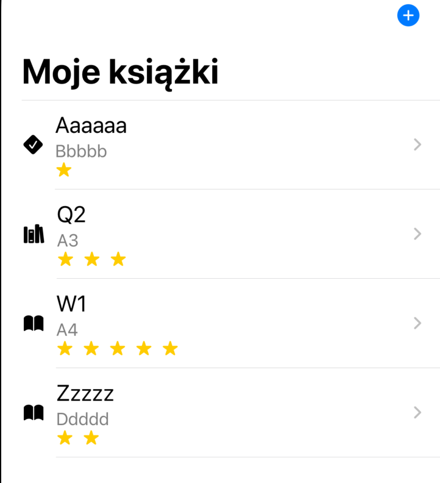
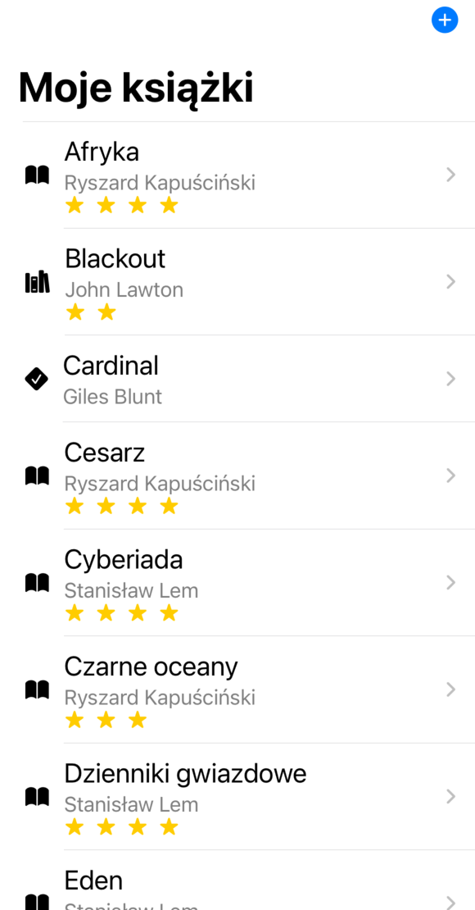

# My Books

oryginalne video :

https://www.youtube.com/watch?v=CAr_1kcf2_c&t=4s


Aplikacja korzystająca z Swift Data. W pierwszym zestawie trzech filmów będziemy tworzyć aplikację do śledzenia książek, które albo umieściliśmy na półce, albo aktualnie czytamy, albo już przeczytaliśmy. Ten film będzie najdłuższy w tej serii, wprowadzę was do operacji CRUD, czyli tworzenia, odczytu, aktualizacji i usuwania rekordów, oraz jak je trwale przechowywać w bazie danych SQLite na urządzeniu. W kolejnych sekcjach po tym filmie rozwiniemy tę aplikację i przedstawię wam relacje, takie jak relacje jeden-do-wielu oraz wiele-do-wielu. Będziemy nawet zagłębiać się w lokalizację i CloudKit.  Chcemy stworzyć aplikację na iPhone'a, która pozwoli nam dodawać i śledzić książki, które zdobyliśmy i które czekają na przeczytanie, są w trakcie czytania lub zostały już przeczytane. Możemy także chcieć dodać podsumowanie książki lub nawet ocenę. Zaczynajmy więc od utworzenia nowej aplikacji teraz w Xcode i nazwiemy ją "Moje Książki". Moglibyśmy wybrać SwiftData jako opcję przechowywania danych, ale to spowodowałoby konieczność zmiany wielu podstawowych fragmentów kodu, a poza tym z SwiftData bardzo łatwo ręcznie tworzyć nasze modele danych i przechowywać je. 

## Books model

Zaczniemy od utworzenia modelu dla naszej książki. Kiedy tworzę nowy wpis, chcę po prostu dodać tytuł i autora, dlatego ustalimy domyślne wartości dla pozostałych właściwości, ale o tym jeszcze porozmawiam. Zacznijmy więc od utworzenia pliku Swift o nazwie "Book". Wewnątrz utworzymy klasę o nazwie "Book" i dodamy kilka właściwości. Będziemy potrzebowali tytułu i autora, oba będą typu String. Chcę śledzić datę dodania książki, datę rozpoczęcia jej czytania i datę jej zakończenia.

Wszystkie te właściwości będą typu daty, i możesz pomyśleć, że właściwości `started` i `completed` powinny być opcjonalne. Ale uważam, że ponieważ zamierzam użyć pickera, łatwiej jest ustawić wartość domyślną, o czym niedługo zobaczysz. Dla podsumowania stworzę właściwość typu String, a dla oceny utworzę opcjonalną wartość całkowitą (`Int`). 

```swift
class Book {
    var title: String
    var author: String
    var dateAdded: Date
    var dateStarted: Date
    var dateCompleted: Date
    var summary: String
    var rating: Int?
}
```


Aby śledzić status naszej książki, stworzę enuma dla tej właściwości i nazwę go `status`. Utworzę go tutaj, w tym samym pliku. Zdefiniuję go jako Int, ale dla Swift Data musimy upewnić się, że jest Codable. Chcę również używać go w pickerze, więc musi być identyfikowalny (`Identifiable`). Jeśli użyję case iterable, będę mógł iterować przez wszystkie różne przypadki. Trzy przypadki, które chcę obejmować, to `onShelf`, `inProgress` i `completed`.

```swift
enum Status: Int, Codable, Identifiable, CaseIterable {
  case onShelf,inProgress, completed
}
```

 Aby spełnić protokół `Identifiable`, mogę utworzyć obliczoną właściwość `id` typu `Self`, która po prostu zwróci `self`. 

```swift
    var id: Self {
        self
    }
```

Teraz picker będzie potrzebować pewnego tekstu do wyświetlenia dla każdego przypadku. Utworzę więc kolejną obliczoną właściwość, którą nazwę `description` , która będzie typu String. Użyję instrukcji switch na `self` i dla każdego przypadku zwrócę tekstową reprezentację tego przypadku. Tak więc OnShelf, InProgress lub Completed. Teraz mogę dodać właściwość `status` do naszej klasy, która będzie miała ten typ `status`. 

```swift
    var description: String {
        switch self {

        case .onShelf:
            "On Shelf"
        case .inProgress:
            "In Progress"
        case .completed:
            "Completed"
        }
    }
```

Następnie, ponieważ używam klasy, będę potrzebować inicjalizatora. Pozwól, że zaznaczę parametry 

```swift
    init(
        title: String,
        author: String,
        dateAdded: Date,
        dateStarted: Date,
        dateCompleted: Date,
        summary: String,
        rating: Int? = nil,
        status: Status
    ) {
        self.title = title
        self.author = author
        self.dateAdded = dateAdded
        self.dateStarted = dateStarted
        self.dateCompleted = dateCompleted
        self.summary = summary
        self.rating = rating
        self.status = status
    }
```

naszego inicjalizatora i użyję skrótu Ctrl+M wprowadzonego w Xcode 15, aby rozdzielić je na wiele linii. 


Jak wspomniałem, jedynym, co będę wymagać, to podanie tytułu książki i autora. Oznacza to, że będę musiał dostarczyć domyślne wartości dla każdej innej właściwości.

Data dodania zostanie przypisana jako aktualna data (`Date()` lub `Date.now`). Ponownie, zamiast sprawiać, że `dateStarted` i `dateCompleted` będą opcjonalne i trzeba będzie sprawdzać to ręcznie, użyję statycznego `date.distantPastDate`, ponieważ książka jeszcze nie została zaczęta lub zakończona. Dla podsumowania użyję pustego ciągu znaków (`""`), a ocena domyślnie będzie `nil`. Status książki zostanie ustawiony na "onShelf" (na półce), gdy książka zostanie dodana.

```swift
    init(
        title: String,
        author: String,
        dateAdded: Date = Date.now,
        dateStarted: Date = Date.distantPast,
        dateCompleted: Date = Date.distantPast,
        summary: String = "",
        rating: Int? = nil,
        status: Status = .onShelf
    ) {
        ...
    }
```

Teraz, aby nasz model stał się obiektem Swift Data, musimy zaimportować Swift Data i oznaczyć naszą klasę makrem `@Model`. 

```swift
import Foundation
import SwiftData

@Model
class Book { 
  ...
}
```

W ten sposób, podczas tworzenia nowej książki, będziemy musieli podać tylko nazwę i autora, a domyślne wartości zostaną ustawione dla pozostałych właściwości. 

Całość:

```swift
import Foundation
import SwiftData
import SwiftUI

@Model
class Book {
    var title: String
    var author: String
    var dateAdded: Date
    var dateStarted: Date
    var dateCompleted: Date
    var summary: String
    var rating: Int?
    var status: Status

    init(
        title: String,
        author: String,
        dateAdded: Date = Date.now,
        dateStarted: Date = Date.distantPast,
        dateCompleted: Date = Date.distantPast,
        summary: String = "",
        rating: Int? = nil,
        status: Status = .onShelf
    ) {
        self.title = title
        self.author = author
        self.dateAdded = dateAdded
        self.dateStarted = dateStarted
        self.dateCompleted = dateCompleted
        self.summary = summary
        self.rating = rating
        self.status = status
    }
    
}
enum Status: Int, Codable, Identifiable, CaseIterable {
  case onShelf,inProgress, completed
    var id: Self {
        self
    }
    var description: String {
        switch self {

        case .onShelf:
            "On Shelf"
        case .inProgress:
            "In Progress"
        case .completed:
            "Completed"
        }
    }
}
```


Teraz, gdy mamy nasz model, musimy, gdy aplikacja zostanie uruchomiona, utworzyć dla niego kontener, aby można było zachować dane. Z pomocą Swift Data jest to niezwykle łatwe. Podczas uruchamiania naszej aplikacji, możemy zastosować metodę Swift Data do naszej grupy okien. Importuję Swift Data i teraz mamy dostęp do metody `modelContainer`. Jedynym wymogiem jest podanie typu modelu, który chcemy przechowywać jako trwały. Dla naszego przypadku, naszym modelem jest nasza książka, więc używamy `.self`. 

```swift
import SwiftUI
import SwiftData

@main
struct MyBooksApp: App {
    var body: some Scene {
        WindowGroup {
            ContentView()
        }
        .modelContainer(for: Book.self)
    }

}
```

Lubię sprawdzić, gdzie są przechowywane dane backendowe. Odkryłem, że podobnie jak Core Data, Swift Data domyślnie przechowuje dane w katalogu application support dla naszej aplikacji w symulatorze. Chcę więc utworzyć inicjalizator dla naszej aplikacji, który zostanie wywołany podczas jej uruchamiania, a następnie wydrukować ścieżkę do tego miejsca. Ponieważ katalog application support w Finderze zawiera więcej niż jedno słowo, chcę usunąć znaki procentowe (`%20s`), które będą generowane dla każdej spacji, ustawiając `percentEncoded` na `false`.

```swift
    init() {
        print(URL.applicationSupportDirectory.path(percentEncoded: false))
    }
```


Teraz uruchomię tę aplikację i wyświetlę konsolę po uruchomieniu. Widzę, że ścieżka jest wydrukowana w konsoli. 

```swift
/Users/uta/Library/Developer/CoreSimulator/Devices/65D28238-47E9-40BE-8185-EB5A26699637/data/Containers/Data/Application/442223B0-C445-493F-BC5A-AEE8A2BC8B81/Library/Application Support/
```

Wybiorę teraz tę ścieżkę, kliknę prawym przyciskiem myszy i z menu Usługi wybiorę opcję "Otwórz lokalizację", aby wyświetlić trzy pliki, tak jak w przypadku Core Data. Pierwszy plik to default.store, to plik SQLite, który chcę przejrzeć za pomocą edytora SQLite. Możecie użyć dowolnego edytora, który wam odpowiada, ale znalazłem ten darmowy, który może być dobrym wyborem na początek.

https://sqlitebrowser.org/dl/

można go zainstalować  za pomocą brew: 

```swift
brew install --cask db-browser-for-sqlite
```

Teraz, jeśli kliknę prawym przyciskiem myszy na ten plik i otworzę go w aplikacji, zauważycie, że podobnie jak w Core Data w tej bazie danych jest wiele tabel wsparcia. Ale jest jedna dla naszego modelu książki. Nie martwcie się o literę Z na początku - to jest coś związane z Core Data i Swift Data. Teraz, jeśli wybierzecie Przeglądaj dane i wybierzecie tabelę, którą chcemy zobaczyć, czyli naszą tabelę książek, zobaczycie, że są tam kolumny dla wszystkich naszych właściwości. 


## Operacje CRUD

## NewBookView czyli Create  

Na razie nie utworzyliśmy jeszcze żadnych książek, ale wrócimy do tego, gdy to zrobimy. Pierwsza litera w skrócie CRUD oznacza C, co oznacza Create (Utwórz). Zobaczmy więc, jak możemy tworzyć nowe książki i przechowywać je w naszej bazie danych. Teraz zmienię nazwę widoku  `ContentView` na `BookListView`. Umieszczę obecnie ten widok w nawigacyjnym stosie i dodam tytuł nawigacji "Moje Książki". Następnie utworzę pasek narzędzi i będę miał na nim tylko jeden przycisk.

W ramach tego paska narzędziowego mogę utworzyć przycisk, na razie pomijając akcję. Ale jako etykietę chcę utworzyć obrazek, używając systemowego symbolu `plus.circle.fill`. Następnie ustawiam skalę obrazka na dużą (`large`). 

```swift
struct BookListView: View {
    var body: some View {
        NavigationStack {
            VStack {
                ...
            }
            .padding()
            .navigationTitle("Moje książki")
            .toolbar{
                Button {

                } label : {
                    Image(systemName: "plus.circle.fill")
                        .imageScale(.large)
                }
            }
        }
    }
}
```


Chcę móc wyświetlić arkusz na dole, który zapyta o nazwę i autora książki. Dlatego utworzę nowy plik, który nazwę `NewBookView`. Będzie to widok SwiftUI. Dodam dwie właściwości stanu, jedną dla tytułu i drugą dla autora, obie domyślnie ustawione na puste ciągi znaków. Ponieważ będę go prezentować jako modalny arkusz, aby go zamknąć, dodam zmienną środowiskową dla wartości klucza `dismiss` i utworzę ją jako `dismiss`. 

```swift
struct NewBookView: View {
    @Environment(\.dismiss) var dismiss
    @State private var title = ""
    @State private var author = ""
    var body: some View {
        ...
    }
}
```

Zbudujmy teraz ten widok, zastępując zawartość `body` nawigacyjnym stosem, a wewnątrz tego stosu utworzymy formularz. Wewnątrz formularza utworzę dwa pola tekstowe. Pierwsze będzie polem tekstowym z napisem "Tytuł książki", związane z naszą właściwością stanu `title`. Zrobię to samo dla drugiego, które będzie naszym polem na autora, związanym z właściwością stanu `author`. Poniżej dodam kolejny przycisk z etykietą "Zapisz", a jako akcję na razie będę wywoływać "Dismiss". Ustawiam ramkę tak, aby współgrała z brzegiem od strony prawej, mogę to zrobić, określając maksymalną szerokość na nieskończoność z wyjustowaniem do prawego brzegu. Aby się wyróżniał, nadam przyciskowi styl graniczy wyraźnie (`borderedProminent`). Dodam też nieco wypełnienia pionowego. Nie chcę również, aby użytkownik mógł nacisnąć przycisk, dopóki nie wpisze zarówno tytułu, jak i autora. Mogę więc go wyłączyć, jeśli albo tytuł, albo autor jest pusty. Następnie dodam nawigacyjny tytuł z napisem "Nowa Książka" i ustawiam tryb wyświetlania tytułu na "Inline". 

```swift
        NavigationStack{
            Form{
                TextField("Tytuł ksiązki",text: $title)
                TextField("Autor",text: $author)
                Button("Zapisz") {
                    dismiss()
                }
                .frame(maxWidth: .infinity, alignment: .trailing)
                .buttonStyle(.borderedProminent)
                .padding(.vertical)
                .disabled(title.isEmpty || author.isEmpty)
                .navigationTitle("Nowa książka")
                .navigationBarTitleDisplayMode(.inline)
            }
        }
```


Swift Data przechowuje wszystkie dane w pamięci, a informacje nie są przechowywane w bazie danych, chyba że jest to konieczne - na przykład podczas tworzenia, aktualizacji lub usuwania rekordów. Te operacje są zarządzane przez główny kontekst kontenera.

Gdy utworzyliśmy nasz kontener, został utworzony kontekst i umieszczony w środowisku, gdzie mogę uzyskać do niego dostęp za pomocą ścieżki klucza modelu (`modelContextKeyPath`). Pozwólcie mi teraz utworzyć zmienną o nazwie `context` z tego klucza środowiskowego. 

```swift
struct NewBookView: View {
    @Environment(\.modelContext) private var context
  ...
}
```

Aby utworzyć nową książkę w akcji "Utwórz", możemy utworzyć tę książkę, przekazując tytuł i autora z naszych pól tekstowych w stanie. Następnie mogę po prostu wywołać metodę `context.insert`, przekazując do niej tę książkę, a potem oczywiście zamkniemy arkusz. 

```swift
                Button("Zapisz") {
                    let newBook = Book(title: title, author: author)
                    context.insert(newBook)
                    dismiss()
                }
```

Wróćmy teraz do widoku listy książek `BookListView`. Tutaj będziemy musieli wyświetlić arkusz po naciśnięciu przycisku paska narzędziowego. Stworzymy zatem stanową właściwość typu boolowskiego, którą nazwę `createNewBook` i zainicjalizuję jako `false`. Po pasku narzędziowym utworzę arkusz, który będzie związany z właściwością stanu `isPresented` (czyli `createNewBook`). Użyję tutaj domknięcia związującego. Posprzątam to trochę. Następnie jako zawartość wyświetlę widok `NewBookView`. Nie chcę, żeby był pełnoekranowy, więc ustawiam sposób wyświetlania na `medium` w tablicy detent. Aby wyświetlić widok, będziemy musieli ustawić wartość `createNewBook` na `true` w akcji przycisku paska narzędziowego. 

```swift
struct BookListView: View {
    @State  private var createNewBook = false
    var body: some View {
        NavigationStack {
            VStack {
                Image(systemName: "globe")
                    .imageScale(.large)
                    .foregroundStyle(.tint)
                Text("Hello, world!")
            }
            .padding()
            .navigationTitle("Moje książki")
            .toolbar{
                Button {
                    createNewBook = true
                } label : {
                    Image(systemName: "plus.circle.fill")
                        .imageScale(.large)
                }
            }
            .sheet(isPresented: $createNewBook) {
                NewBookView()
                    .presentationDetents([.medium])
            }
        }
    }
}
```

Teraz uruchommy aplikację w symulatorze i stwórzmy nową książkę. Musisz podać tytuł i autora. Możesz utworzyć wpis dla prawdziwej książki lub wymyślić jakąś, jak ja robię teraz. Zatrzymajmy teraz aplikację i otwórzmy ponownie nasz edytor SQL, aby zobaczyć, co mamy. Tym razem uzyje lubiane przeze mnie DataGrip:


nastepnie przechodzimy do nowo dodanej gaqlezi w database explorer, wybieramy ZBOOK, następnie tabelę książek:


 Zauważ, że wartości zostały wprowadzone dla wszystkich pól oprócz oceny, która jest ustawiona na `null`, ponieważ była opcjonalna. Wydaje się, że pole podsumowania jest puste, ale jest to pusty ciąg znaków. Teraz, aby mieć coś do pracy w naszym następnym etapie, stwórzmy kilka kolejnych wpisów w aplikacji. 


Jeszcze jedno, co chcę zrobić, to w moim widoku `NewBookView` dodać przycisk "Anuluj", aby zamknąć widok, jeśli nie chcemy tworzyć nowej książki, gdy wyświetlimy ten arkusz. Potrzebuję paska narzędziowego, a ten przycisk chcę umieścić z przodu, więc będę musiał utworzyć element paska narzędziowego i ustawić jego umiejscowienie na `topBarLeading`. Wewnątrz niego po prostu utworzę przycisk z etykietą "Anuluj", a jako akcję po prostu wywołam funkcję `dismiss`. 

```swift
                .toolbar{
                    ToolbarItem(placement: .topBarLeading) {
                        Button("Anuluj") {
                            dismiss()
                        }
                    }
                }
```


Całość kodu `NewBokView` :

```swift
struct NewBookView: View {
    @Environment(\.modelContext) private var context
    @Environment(\.dismiss) var dismiss
    @State private var title = ""
    @State private var author = ""
    var body: some View {
        NavigationStack{
            Form{
                TextField("Tytuł ksiązki",text: $title)
                TextField("Autor",text: $author)
                Button("Zapisz") {
                    let newBook = Book(title: title, author: author)
                    context.insert(newBook)
                    dismiss()
                }
                .frame(maxWidth: .infinity, alignment: .trailing)
                .buttonStyle(.borderedProminent)
                .padding(.vertical)
                .disabled(title.isEmpty || author.isEmpty)
                .navigationTitle("Nowa książka")
                .navigationBarTitleDisplayMode(.inline)
                .toolbar{
                    ToolbarItem(placement: .topBarLeading) {
                        Button("Anuluj") {
                            dismiss()
                        }
                    }
                }
            }
        }
    }
}
```

wariant alternatywny przycisk anuluj mozna dac obok przycisku zapisz osadzajac oba w HStack i przenoszac modyfikatory przycisku zapisz bezposrednio do niego:

```swift
HStack{
  Button("Anuluj") {

    dismiss()
  }
  .frame(maxWidth: .infinity, alignment: .leading)
  .buttonStyle(.bordered)

  Button("Zapisz") {
    let newBook = Book(title: title, author: author)
    context.insert(newBook)
    dismiss()
  }
  .frame(maxWidth: .infinity, alignment: .trailing)
  .buttonStyle(.borderedProminent)
  .padding(.vertical)
  .disabled(title.isEmpty || author.isEmpty)
}
```


## BookListView czyli Read  

Teraz, gdy mamy już jakieś wpisy, będziemy musieli je wyświetlić, co odpowiada literze R w akronimie CRUD. Będziemy prezentować te elementy w liście. Domyślnie tablice obiektów modelu trwałego spełniają protokół `Identifiable`. Każdy rekord w tabeli książek ma unikalne ID obiektu, o którym dowiemy się trochę później. Najpierw będziemy musieli uzyskać dostęp do wszystkich rekordów. Można to zrobić za pomocą nowego makra `query`, które jest częścią Swift Data. Obserwuje ono zmiany i odświeża widok za każdym razem, gdy wystąpią nowe zmiany. Najpierw będziemy musieli zaimportować SwiftData.

Następnie możemy użyć makra, które może przyjąć porządek sortowania i opcję filtrowania. Na razie pomińmy filtr i pobierzmy wszystkie nasze obiekty, ale ustawmy domyślny porządek sortowania jako rosnący i określmy właściwość, według której chcemy sortować, używając ścieżki klucza. Później będziemy patrzeć na sortowanie według wielu właściwości, używając tablicy deskryptorów sortowania, ale na razie użyjemy tylko ścieżki klucza i przypiszemy to do prywatnej zmiennej o nazwie `books`. `books` będzie tablicą obiektów typu `Book`.

```swift
@Query(sort: \Book.title) private var books: [Book]
```

Teraz możemy zastąpić naszego `VStack` listą, ale chcemy móc używać funkcji `onDelete` na elementach naszej listy. Musimy więc użyć pętli `forEach` wewnątrz listy. W tej liście chcę stworzyć link nawigacyjny, który zabierze mnie w końcu do ekranu szczegółowego, gdzie będę mógł przeglądać i / lub edytować pozostałe właściwości. Ale na razie utwórzmy link nawigacyjny, który zabierze mnie do widoku tekstu, który wyświetli tytuł książki. Dla etykiety będę chciał wyświetlić tytuł i autora, a także ikonę reprezentującą status książki. Jeśli jest ocena, chcę również wyświetlić odpowiednią liczbę gwiazdek reprezentujących tę ocenę. Ustawmy także styl listy na zwykłą listę (`plain list`).

```swift
List {
  ForEach(books) { book in
                  NavigationLink{

                  } label: {

                  }
                 }

}
.listStyle(.plain )
```

Teraz, jeśli chcemy móc używać podglądu, będziemy musieli dodać kontener modelu do naszego widoku listy książek również w podglądzie. Ale nie chcemy przechowywać danych w naszym podglądzie, chcemy je trzymać tylko w pamięci i nie zapisywać ich trwale. Oczywiście moglibyśmy to zrobić, ale później może to stworzyć pewne problemy. W teście zaczynamy tak samo jak w sekcji `@Main`, ale tym razem dodamy dodatkowy argument `inMemory` i ustawimy go na `true`. 

```swift
#Preview {
    BookListView()
        .modelContainer(for: Book.self, inMemory: true)
}
```

Teraz wróćmy do naszego modelu książki i stworzymy właściwość obliczeniową, która będzie reprezentować inną ikonę dla statusu naszej książki. Właściwości obliczeniowe nie są przechowywane w bazie danych SQLite, więc nasza struktura nie będzie się zmieniać. Możemy utworzyć tę zmienną i nazwę ją "icon", a będzie to obrazek. Teraz `Image` jest dostępne tylko w SwiftUI, więc będziemy musieli zaimportować SwiftUI zamiast Foundation. Teraz możemy przełączyć się na ten status i utworzyć odpowiednie obrazy. Oto te, które zamierzam użyć: dla `onShelf` będzie to obrazek używający systemowego symbolu "checkmark.diamond.fill", dla `inProgress` użyję "book.fill", a dla `completed` użyję "books.vertical.fill". 

```swift
var icon: Image {
  switch status {

    case .onShelf:
    Image(systemName: "checkmark.diamond.fill")
    case .inProgress:
    Image(systemName: "book.fill")
    case .completed:
    Image(systemName: "books.vertical.fill")
  }
}
```


Wróćmy teraz do naszego widoku listy książek i utwórzmy etykietę dla naszego linku nawigacyjnego. Zacznę od `HStack` z odstępem 10. A pierwszym elementem w tym `HStack` będzie obrazek ikony książki. Po prawej stronie tego umieszczę pionowy stos (`VStack`) z wyrównaniem do lewej. Pierwszy wiersz będzie zawierał pole tekstowe wyświetlające tytuł. Następnie ustawię czcionkę na tytułową o rozmiarze 2. Poniżej tego kolejny wiersz będzie kolejnym polem tekstowym, ale tym razem wyświetlającym autora książki. Zmienię również styl koloru tekstu na drugoplanowy (`secondary`). 

```swift
HStack(spacing: 10) {
  book.icon
  VStack(alignment: .leading) {
    Text(book.title)
    .font(.title2)
    Text(book.author)
    .foregroundStyle(.secondary)
  }
}
```

Ponieważ nie wszystkie książki mają ocenę, użyję instrukcji `if let` do obsłużenia  oceny książki. A jeśli istnieje, mogę utworzyć kolejny stos horyzontalny (`HStack`), który przeiteruje od 0 do samej oceny i ustawienie ID jako `self`. Wewnątrz tej pętli mogę utworzyć obrazek za pomocą systemowego obrazka gwiazdki wypełnionej (`star.fill`). Ustawię skalę obrazka na małą (`small`) i zmienię styl koloru tekstu na żółty.

```swift
if let rating = book.rating {
  HStack {
    ForEach(0..<rating, id:\.self) { _ in
                                    Image(systemName: "star.fill")
                                    .imageScale(.small)
                                    .foregroundStyle(.yellow)
                                   }
  }
}
```

Teraz uruchommy to na naszym symulatorze i zobaczmy, co się stanie. Zobaczymy wszystkie trzy książki, które utworzyliśmy. Żadna z nich nie ma oceny, a wszystkie ikony są dla statusu "on shelf", ponieważ taki był domyślny podczas ich tworzenia. Zatrzymajmy teraz aplikację. Otworzę bazę danych w moim edytorze SQL i chcę edytować niektóre właściwości. Przejdźmy do przeglądania danych naszej tabeli książek. Mogę na przykład zaktualizować dwa z naszych statusów. Dla statusu 2, który oznacza "completed", nadam ocenę 4. Zamknijmy bazę danych i uruchommy ponownie. Widzimy, że nasze aktualizacje zostały zastosowane. Mamy różne ikony dla różnych statusów, i widzimy ocenę.



Możemy także przetestować to w podglądzie. W podglądzie mogę utworzyć nowy element. Jednak jeśli zaktualizuję kod lub przejdę do widoku wybierania w podglądzie, a potem z powrotem, ten element zniknie, ponieważ nie zapisujemy danych trwale. Teraz, gdy nie ma książek na liście, powinniśmy poinformować naszych użytkowników, żeby stworzyli swoją pierwszą książkę.  Sprawdźmy, czy tablica `Books` jest pusta. Jeśli tak, wyświetlmy widok `ContentUnavailable` z tekstem "Wprowadź swoją pierwszą książkę". Użyję także systemowego obrazka książki (`book.fill`).

```swift
if books.isEmpty {
    ContentUnavailableView("Wprowadź pierwszą książkę", systemImage: "book.fill")
}
```

 Jeśli nie jest pusta, utworzymy klauzulę `else` i wyświetlimy istniejącą  listę książek. 

```swift
if books.isEmpty {
  ContentUnavailableView("Wprowadź pierwszą książkę", systemImage: "book.fill")
} else {
  List {...}
  .navigationTitle("Moje książki")
  .toolbar{...}
  .listStyle(.plain )
  .sheet(isPresented: $createNewBook) {...}
}
```

Problem polega na tym, że mamy tytuł i pasek narzędziowy, które chcę, aby zawsze się pojawiały, ale nie możemy ich przypisać do instrukcji warunkowej `if-else`. Więc będę musiał zamknąć całą tę instrukcję warunkową `if-else` w grupie (`Group`),przeniesiemy odpowiednie modyfikatory z List pod Group  dzięki czemu nasz pasek narzędziowy i tytuł zostaną wyświetlone .

```swift
        NavigationStack {
            Group {
                if books.isEmpty {
                    ...
                } else {
                    List {...}
                    .listStyle(.plain )
                }
            }
            .navigationTitle("Moje książki")
            .toolbar{...}
            .sheet(isPresented: $createNewBook) {...}
        }
```

 

W naszej podglądzie widzimy widok "Zawartość niedostępna", ale gdy tworzymy naszą pierwszą książkę, widok ten znika i zostaje zastąpiony listą. Wykonaliśmy już operacje tworzenia (Create) i odczytu (Read) z naszego akronimu CRUD. 

### Usuwanie danych - Delete z CRUD

Mamy jeszcze dwie pozostałe do zrobienia: Aktualizację (Update) i Usunięcie (Delete). Usunięcie jest najłatwiejsze, więc zróbmy to teraz. Ponieważ użyliśmy pętli forEach, możemy teraz skorzystać z funkcji onDelete, która pozwoli nam uzyskać dostęp do zestawu indeksów, na których przesunęliśmy palcem. Następnie możemy przejść przez każdy z naszych indeksów, używając kolejnej pętli forEach, aby uzyskać indeks naszej tablicy książek, którą chcemy usunąć. Potem pozwólmy, aby zmienna "book" równała się książce o indeksie. Podobnie jak przy dodawaniu książki, potrzebowaliśmy dostępu do kontekstu, aby ją dodać. Podobnie, będziemy musieli mieć dostęp do tego kontekstu, aby ją usunąć. Zatem ponownie będziemy musieli dodać właściwość środowiskową o ścieżce klucza "model.context". Przypiszę ją do zmiennej o nazwie "context". Teraz możemy użyć tego kontekstu, aby usunąć naszą książkę. 

```swift
                    List {
                        ForEach(books) {...}
                        .onDelete { indexSet in
                            indexSet.forEach{ index in
                                let book = books[index]
                                context.delete(book)
                            }
                        }
```

Możemy przetestować to na oknie podglądu, dodając najpierw nową książkę. I znowu, gdy to zrobiliśmy, widok "Zawartość niedostępna" zniknął, a książka pojawiła się na liście. Ale teraz mamy akcję przesunięcia palcem z prawej strony, która pozwala nam usunąć. A kiedy to zniknie, widok "Zawartość niedostępna" pojawia się ponownie. Przetestujmy to teraz na symulatorze i spójrzmy na nasze przechowywane dane. Usuńmy tę fikcyjną książkę tutaj. 

.gif)

Sprawdźmy jeszcze raz, wracając do naszej bazy danych SQL w edytorze SQL. Jeśli przejdę do karty "Przeglądaj dane" dla naszej tabeli "book", widzę teraz tylko dwie pozycje, podczas gdy wcześniej miałem trzy. Wszystko wygląda dobrze do tej pory. 

###  Aktualizacja danych czyi Update z CRUD

Mamy teraz ostatnią część naszego akronimu CRUD, czyli Aktualizację (Update). Będziemy mogli zaktualizować wszystkie pola w naszym modelu książki. W związku z tym będę musiał stworzyć nowy widok. Stwórzmy więc widok SwiftUI, który nazwiemy "EditBookView". Ten widok będzie wyświetlany, gdy klikniemy na nasz wiersz, który jest naszym odnośnikiem nawigacyjnym z widoku listy. Będziemy więc musieli otrzymać książkę, na którą kliknięto. Stworzę stałą dla tego obiektu, o nazwie "book", która będzie typu "book". Kiedy to zrobimy, podgląd będzie wymagać wstrzyknięcia książki do środowiska, ale nie będzie wiedział, gdzie znaleźć ten obiekt i jak go uzyskać, więc podgląd nie załaduje się. Na razie zamknę to wywołanie i zbuduję moje UI, a potem przetestuję je na urządzeniu, aby pokazać, że działa. W następnym filmie z tej serii pokażę ci, jak można rozwiązać ten problem, tworząc kontener w pamięci z przykładowymi danymi. Teraz ten widok będzie aktualizować każdą właściwość. Zamiast wiązać te właściwości bezpośrednio z każdą właściwością w książce do pól tekstowych, pickerów i edytorów tekstu, wolałbym utworzyć odpowiadającą właściwość stanu dla każdej z tych właściwości. Powodem tego jest, że jeśli użyję książki jako obiektu wiążącego zamiast stałej, będę mógł bezpośrednio wiązać każdą z właściwości z samą książką. Jednakże problem polega na tym, że po dokonaniu zmian, Core Data automatycznie aktualizuje i zapisuje te zmiany, co może być niepożądane. Chcę dać użytkownikowi szansę na dokonanie aktualizacji tylko wtedy, gdy nastąpiły zmiany. Zamiast korzystać z formularza, zamierzam użyć wielu widoków z etykietami, ponieważ pozwoli mi to na większą kontrolę nad układem. Na początek stworzymy właściwość stanu dla każdej z ośmiu różnych właściwości książki, które chcemy zaktualizować, i przypiszemy wartości domyślne dla wszystkich wartości, które nie są opcjonalne.

```swift
struct EditBookView: View {
   // var book: Book
    @State private var status = Status.onShelf
    @State private var rating: Int?
    @State private var title = ""
    @State private var author = ""
    @State private var summary = ""
    @State private var dateAdded = Date.distantPast
    @State private var dateStarted = Date.distantPast
    @State private var dateCompleted = Date.distantPast
}
```

 Kiedy załadujemy ten widok, przypiszemy wartości przekazywanej książki w metodzie onAppear, aby zastąpić je obecnymi wartościami. Daty nie są opcjonalne, ale ponieważ zostaną zastąpione przez wersje książki, możemy po prostu użyć date.distantPast we wszystkich przypadkach. Stworzyłem prywatną właściwość stanu dla każdej z naszych różnych właściwości w naszym modelu. Dla wszystkich oprócz oceny (rating) stworzyłem wartość domyślną. 

​	Zamieńmy teraz zawartość widoku na HStack. Jako pierwszy widok, stworzę pole tekstowe (textView) z służacy za etykietę z tekstem "Status". Następnie utworzymy picker z etykietą "status", gdzie wybór będzie powiązany ze zmienną stanu statusu. Teraz, ponieważ case'y w enumie status są iterable, możemy użyć pętli forEach, aby przejść przez wszystkie przypadki statusu i uzyskać iterator statusu, który możemy wykorzystać do utworzenia pola tekstowego (textView) wyświetlającego właściwość statusDescript. Następnie będziemy musieli ustawić tag na sam status, aby zaktualizować tę zmienną stanu statusu po wybraniu odpowiedniego statusu. Dodatkowo ustawiam styl przycisku na bordered, co sprawia, że jest bardziej widoczny. 

```swift
        HStack{
            Text("Status")
            Picker("Status",selection: $status) {
                ForEach(Status.allCases) { status in
                    Text(status.description).tag(status)

                }
            }
            .buttonStyle(.bordered)
        }
```

Poniżej HStacka wyświetlę pozostałe siedem właściwości. Utworzymy więc VStack z ustawionym wyrównaniem na leading. Na początek wyświetlę wszystkie daty, ale tylko te istotne. Więc jeśli status jest "na półce", będę wyświetlać tylko datę dodania. Jeśli jest "w trakcie", pokażę datę dodania i datę rozpoczęcia. Jeśli jest "zakończone", pokażę wszystkie trzy. Chcę, aby były one zawarte w grupie (GroupBox), aby się wyróżniały. Tutaj możemy użyć oznaczonych zawartości (labeled content) z konstruktorem content i label. Dla pierwszej daty, content będzie stanowić date picker, gdzie klucz tytułu będzie pustym ciągiem, a selection będzie powiązane z właściwością daty dodania. Ustawię komponenty wyświetlania tylko na datę. Nie interesuje mnie godzina. Następnie dla etykiety użyję pola tekstowego (textView) z etykietą "data dodania". Zawsze będziemy wyświetlać datę dodania, ponieważ domyślnie tworzymy bieżącą datę, gdy dodajemy nową książkę. Datę rozpoczęcia jednak będziemy musieli sprawdzić, czy status jest "w trakcie" lub "zakończone". Jeśli tak, możemy użyć kolejnej oznaczonej zawartości (labeled content), gdzie content będzie kolejnym date pickerem z pustym kluczem tytułu, tym razem powiązanym z datą rozpoczęcia. Znowu użyjemy komponentów wyświetlania daty. Dla daty zakończenia, najpierw sprawdzimy, czy status jest "zakończone". Jeśli tak, utworzymy kolejną oznaczoną zawartość, wyświetlającą datę zakończenia. Dodajmy także styl przedniego planu (foreground) na całą grupę, ustawiając go na sekundarny. 

```swift
        VStack(alignment: .leading) {
            GroupBox {
                LabeledContent {
                    DatePicker("",selection: $dateAdded, displayedComponents: .date)
                } label: {
                    Text("Data dodania")
                }

                if status == .inProgress || status == .completed {
                    DatePicker("Data rozpoczęcia",selection: $dateStarted, displayedComponents: .date)
                }
                if status == .completed {
                    DatePicker("Data przeczytania",selection: $dateCompleted, displayedComponents: .date)
                }
            }
            .foregroundStyle(.secondary)
        }
```

Gdy zmienimy status, będziemy chcieli ewentualnie zresetować daty, ponieważ jeśli przejdziemy z "w trakcie" z powrotem na "na półce", będziemy musieli zresetować datę rozpoczęcia. Sprawdźmy wszystkie przypadki w modyfikatorze onChange. Korzystając z onChange dla statusu, uzyskujemy dostęp zarówno do starej, jak i nowej wartości. 

Jeśli nowa wartość równa jest "na półce", ustawimy datę rozpoczęcia na date.distantPast i datę zakończenia na date.distantPast. 

Jeśli nowa wartość to "w trakcie", a stara wartość to "zakończone", oznacza to, że przeszliśmy z "zakończonego" na "w trakcie", wtedy ustawimy dateCompleted na date.distantPast. 

Kolejny przypadek, to jeśli nowa wartość jest równa "w trakcie", a stara wartość to "na półce", oznacza to, że zaczęliśmy czytać książkę. Możemy więc ustawić datę rozpoczęcia na date.now. 

Kolejny przypadek to, gdy nowa wartość jest równa "zakończone", ale stara wartość to "na półce", co oznacza, że zapomnieliśmy ustawić początek książki i przeskoczyliśmy od "na półce" do "zakończone". Wtedy możemy ustawić datę zakończenia na date.now, ale datę rozpoczęcia ustawimy na tę samą datę, którą dodaliśmy książkę. 

W przeciwnym razie, gdy jest to "zakończone", ustalimy datę zakończenia na date.now. 

```swift
            .onChange(of: status) { oldValue, newValue in
                if newValue == .onShelf {
                    dateStarted = Date.distantPast
                    dateCompleted = Date.distantPast
                } else if newValue == .inProgress && oldValue == .completed {
                    dateCompleted = Date.distantPast
                } else if newValue == .inProgress && oldValue == .onShelf {
                    dateStarted = Date.now
                } else if newValue == .completed && oldValue == .onShelf {
                    dateCompleted = Date.now
                    dateStarted = dateAdded
                } else  {
                    dateCompleted = Date.now
                }
            }
```

Poniżej tego utworzę separator. Jeśli chodzi o ocenę, chcę użyć niestandardowego widoku oceny, który stworzyłem. To jest modyfikacja widoku oceny, który pokazuję w tutorialu o korzystaniu z pakietów Swift. Zostawię link w opisie, jeśli chcesz to sprawdzić. Trochę go zmieniłem, więc nie mogę użyć tego pakietu, ale możesz uzyskać dostęp do kodu z tego gist. Link znajduje się w opisie. Możesz albo utworzyć nowy plik o nazwie "ratingsview" w swoim projekcie i skopiować ten kod, albo po prostu pobrać plik stąd, rozpakować i przeciągnąć go do swojego projektu. 

```swift
// https://gist.github.com/StewartLynch/03372c873fef568e0a613a968adbae69

import SwiftUI

/// A view of inline images that represents a rating.
/// Tapping on an image will change it from an unfilled to a filled version of the image.
///
/// The following example shows a Ratings view with a maximum rating of 10 red flags, each with a width of 20:
///
///     RatingsView(maxRating: 10,
///              currentRating: $currentRating,
///              width: 20,
///              color: .red,
///              ratingImage: .flag)
///
///
public struct RatingsView: View {
    var maxRating: Int
    @Binding var currentRating: Int?
    var width:Int
    var color: UIColor
    var sfSymbol: String
    
    /// Only two required parameters are maxRating and the binding to currentRating.  All other parameters have default values
    /// - Parameters:
    ///   - maxRating: The maximum rating on the scale
    ///   - currentRating: A binding to the current rating variable
    ///   - width: The width of the image used for the rating  (Default - 20)
    ///   - color: The color of the image ( (Default - systemYellow)
    ///   - sfSymbol: A String representing an SFImage that has a fill variabnt (Default -  "star")
    ///
    public init(maxRating: Int, currentRating: Binding<Int?>, width: Int = 20, color: UIColor = .systemYellow, sfSymbol: String = "star") {
        self.maxRating = maxRating
        self._currentRating = currentRating
        self.width = width
        self.color = color
        self.sfSymbol = sfSymbol
    }

    public var body: some View {
        HStack {
                Image(systemName: sfSymbol)
                    .resizable()
                    .scaledToFit()
                    .symbolVariant(.slash)
                    .foregroundStyle(Color(color))
                    .onTapGesture {
                        withAnimation{
                            currentRating = nil
                        }
                    }
                    .opacity(currentRating == 0 ? 0 : 1)
            ForEach(1...maxRating, id: \.self) { rating in
               Image(systemName: sfSymbol)
                    .resizable()
                    .scaledToFit()
                    .fillImage(correctImage(for: rating))
                    .foregroundStyle(Color(color))
                    .onTapGesture {
                        withAnimation{
                            currentRating = rating + 1
                        }
                    }
            }
        }.frame(width: CGFloat(maxRating * width))
    }
    
    func correctImage(for rating: Int) -> Bool {
        if let currentRating, rating < currentRating {
            return true
        } else {
            return false
        }
    }
}

struct FillImage: ViewModifier {
    let fill: Bool
    func body(content: Content) -> some View {
        if fill {
            content
                .symbolVariant(.fill)
        } else {
            content
        }
    }
}

extension View {
    func fillImage(_ fill: Bool) -> some View {
        modifier(FillImage(fill: fill))
    }
}

#Preview {
    struct PreviewWrapper: View {
        @State var currentRating: Int? = 3
        
        var body: some View {
            RatingsView(
                maxRating: 5,
                currentRating: $currentRating,
                width: 30,
                color: .red,
                sfSymbol: "heart"
            )
        }
    }
    return PreviewWrapper()
}
```

Teraz jest dość prosty, jak widać na podglądzie, przekazujesz maksymalną ocenę wraz z obecną oceną, która będzie powiązana z jakąś wartością, którą w naszym przypadku jest to właściwość stanu oceny, właściwość szerokości (width), kolor i symbol SF, który ma trzy różne warianty symboli: normalny, wypełniony i ukośnik. Podgląd wykorzystuje czerwony symbol serca z maksymalną oceną 5 i szerokością 30. Jednak z konstruktora domyślnego wynika, że szerokość wynosi 20, kolor to systemowy żółty, a ja używam symbolu gwiazdy SF. Więc to prawie pasuje do tego, co chcę. Jedyną rzeczą, którą chcę zmienić z domyślnych ustawień, to szerokość. W naszym widoku edycji książki, poniżej separatora, stworzymy kolejny oznaczony widok zawartości. Dla content, stworzymy nowy widok oceny. Określimy maksymalną ocenę na 5. Powiążemy obecną ocenę z naszą właściwością oceny, ale szerokość ustawię na 30. A dla etykiety, po prostu użyję pola tekstowego (textView) z napisem "ocena".

```swift
            LabeledContent{
                RatingsView(maxRating: 5, currentRating: $rating, width: 30)
            }label: {
                Text("Ocena")
            }
```

Przechodząc dalej, dla tytułu naszej książki ponownie użyję oznaczonej zawartości (labeled content), gdzie zawartość to pole tekstowe (text field) z pustym ciągiem jako kluczem tytułu, które jest powiązane z odpowiadającą właściwością stanu. Etykieta będzie po prostu polem tekstowym (text view) pokazującym "tytuł", a ustawie styl przedniego planu na sekundarny. 

```swift
            LabeledContent {
                TextField("", text:$title)
            } label: {
                Text("Tytuł")
            }
```

Skopiuję to dla autora, ponieważ będzie bardzo podobne, ale pole tekstowe będzie powiązane z właściwością stanu autora, a pole tekstowe wskaże "autor" zamiast "tytuł". 

```swift
            LabeledContent {
                TextField("", text: $author)
            } label: {
                Text("Autor")
            }
```

Następnie dodam kolejny separator, a pod nim pole tekstowe (text view), które wyświetli napis "podsumowanie" ze stylem przedniego planu ustawionym na sekundarny. I ostatecznie poniżej edytora tekstu, gdzie tekst jest powiązany z naszą zmienną podsumowania (summary), dodam trochę odstępu o wartości 5. 

```swift
            Divider()
            Text("Opis").foregroundStyle(.secondary)
            TextEditor(text: $summary)
                .padding(5)
```

Następnie dodam nakładkę w postaci zaokrąglonego prostokąta (rounded rectangle) z promieniem naroża wynoszącym 20. Ustawię obrys na kolor korzystający z koloru UI wypełnienia systemowego trzeciego stopnia (tertiary system fill) i grubość linii na 2. 

```swift
.overlay(RoundedRectangle(cornerRadius: 20).stroke(Color(uiColor: .tertiarySystemFill), lineWidth: 2))
```

Pozwól, że trochę to uporządkuję. Dodam odstęp i ustawie styl pola tekstowego na zaokrągloną ramkę (rounded border). Ponieważ będzie to przeniesione na stos nawigacyjny (navigation stack), możemy określić tytuł nawigacji, który będzie wyświetlał tytuł książki. Następnie ustawię tryb wyświetlania tytułu paska nawigacji na inline (inline). Teraz stworzę pasek narzędzi (toolbar), który będzie zawierał przycisk z napisem "Aktualizuj" i na razie pozostawmy akcję, ale ustawmy styl przycisku na wyeksponowany z ramką (Bordered Prominent). 

```swift
  VStack {...}
        .padding()
        .textFieldStyle(.roundedBorder)
        .navigationTitle(title)
        .navigationBarTitleDisplayMode(.inline)
        .toolbar {
            Button("Zapisz") {

            }
            .buttonStyle(.borderedProminent)
        }
```

Nie zobaczysz tego w widoku, ponieważ nasz podgląd nie wie, że znajduje się na stosie nawigacyjnym. Aby to zobaczyć, umieśćmy podgląd w stosie nawigacyjnym. 


```swift
#Preview {
    NavigationStack {
        EditBookView()
    }
}
```

Ale gdy już zakończymy aktualizację, będziemy chcieli zamknąć widok. Będziemy więc potrzebować zmiennej środowiskowej (environment variable) dla tego, używając klucza dismiss (zwolnij). 

```swift
struct EditBookView: View {
    @Environment(\.dismiss) private var dismiss
    var book: Book 
  ...
}
```

Następnie, gdy zaktualizujemy, możemy zamknąć widok. 

```swift
        .toolbar {
            Button("Zapisz") {
                //kod do zapisu
                    dismiss()
            }
            .buttonStyle(.borderedProminent)
        }
```

No cóż, to mniej więcej nasz projekt teraz. Chcemy jednak wyświetlić przycisk aktualizacji tylko wtedy, gdy będą jakieś zmiany w przekazanej książce. Zatem odkomentujmy książkę i zakomentujmy nasz podgląd, który nie będzie działał do następnego lekcji, i zobaczmy, co musimy zrobić, aby zaktualizować książkę. Gdy książka się pojawi, chcemy ustawić właściwości stanu na te, które otrzymujemy od przekazanej książki, jak już wspomniałem. Zróbmy to dla każdej ze zmiennych stanu, dopasowując właściwości modelu z odpowiadającymi właściwościami książki. Status na book status, rating na book rating itd. 

```swift
        .onAppear {
            status = book.status
            rating = book.rating
            title = book.title
            author = book.author
            summary = book.summary
            dateAdded = book.dateAdded
            dateCompleted = book.dateCompleted
            dateStarted = book.dateStarted
        }
```

Jednak chcę wyświetlić ten przycisk aktualizacji tylko wtedy, gdy któraś z tych właściwości zostanie zmieniona. Chcę więc utworzyć obliczeniową właściwość boolowską, którą nazwę "zmienione". Będzie ona sprawdzać, czy któreś z tych właściwości uległy zmianie. Pozwól mi po prostu skopiować to, co było w bloku onAppear i wkleić to tutaj, korzystając z technik edycji. Chcę sprawdzić, czy status nie jest równy statusowi książki, lub to samo będzie dotyczyć każdej z pozostałych właściwości. Więc użyję edycji wielokursorowej, naciskając Control-Shift-klik i przeciągając w dół, abym mógł po prostu dodać "or" i spacje przed każdą z naszych innych linii. Następnie mogę użyć Control-klik i po prostu zmienić równo na różne od. 

```swift
    var changed: Bool {
       status != book.status
      || rating != book.rating
      || title != book.title
      || author != book.author
      || summary != book.summary
      || dateAdded != book.dateAdded
      || dateCompleted != book.dateCompleted
      || dateStarted != book.dateStarted
    }
```

A potem mogę wrócić i wyświetlić ten przycisk paska narzędzi tylko wtedy, gdy dane byly zmienione.


Teraz jest jeden problem z naszymi datami. Ustawianie ich w bloku onAppear wprowadza zamieszanie w naszą właściwość obliczeniową changed ze względu na naszą metodę onChange. Aby to naprawić, zamierzam wprowadzić właściwość logiczną o nazwie firstView i ustawić ją na true, ponieważ chcę, aby właściwości te były ustawiane w bloku onAppear tylko podczas pierwszego pojawienia się widoku, a nie po każdym odświeżeniu. 

```swift
    @State private var firstView = true;
```

Więc teraz wszystko, co muszę zrobić, to zmienić wszystkie nasze przypisania lub zmiany w bloku onChange, korzystając z klauzuli if not firstView. A po ustanowieniu dat, ustawiamy ją na false. 

```swift
            .onChange(of: status) { oldValue, newValue in
                if firstView {

                 if newValue == .onShelf {
                    dateStarted = Date.distantPast
                    dateCompleted = Date.distantPast
                } else if newValue == .inProgress && oldValue == .completed {
                    dateCompleted = Date.distantPast
                } else if newValue == .inProgress && oldValue == .onShelf {
                    dateStarted = Date.now
                } else if newValue == .completed && oldValue == .onShelf {
                    dateCompleted = Date.now
                    dateStarted = dateAdded
                } else  {
                    dateCompleted = Date.now
                }
                    firstView = false
            }
```

Następnie możemy wrócić do naszego paska narzędzi (toolbar) dla akcji. 

Jeślizarejestrowano zmianę, zanim zamkniemy widok, możemy przepisać wszystkie właściwości stanu do obiektu książki, a Swift zajmie się zmianą i zachowaniem tych wartości. Wreszcie wracając do widoku listy książek, gdzie otrzymujemy ten nawigacyjny link do tytułu książki, możemy go zmienić na wyświetlenie widoku edycji książki, przekazując książkę. 

```swift
                    List {
                        ForEach(books) { book in
                            NavigationLink{
                                EditBookView(book:book)
                            } label: { ...}
                    ...                    
```

Chcę się upewnić, że daty dodania, rozpoczęcia i zakończenia są sekwencyjne, i że nie mogę ustawić daty poza sekwencją. Na przykład nie mogę ustawić daty wcześniej niż datę rozpoczęcia. Wróćmy więc do grupy (GroupBox) tutaj i tam, gdzie ustawiamy datę rozpoczęcia, zaznaczę, że nie możemy ustawić daty przed datą dodania. Robimy to, określając zakres za pomocą operatora in, a potem widzimy dateAdded..., trzy kropki. Podobnie dla daty zakończenia będziemy musieli ustawić zakres zaczynający się od dateStarted. 

```swift
if status == .inProgress || status == .completed {
  DatePicker("Data rozpoczęcia",selection: $dateStarted,in: dateAdded..., displayedComponents: .date)
}

if status == .completed {
  DatePicker("Data przeczytania",selection: $dateCompleted,in: dateStarted..., displayedComponents: .date)
}
```

Sprawdźmy to teraz, uruchamiając symulator i zobaczmy, czy nasze dane są zachowane. Utwórzmy wpis do książki, aby się upewnić, że wszystko działa. Pamiętajmy, że potrzebujemy tylko tytułu i autora.


.gif)

 Cóż, to kończy podstawowe operacje CRUD, a kolejne filmy w tej serii nie będą tak długie i będą skupiać się na pojedynczych tematach. W następnym filmie bliżej przyjrzymy się, jak jest konstruowany nasz modelowy kontener i jak możemy nad nim trochę kontrolować. Rozwiążemy także problem w widoku edycji, gdzie nie możemy podglądać książki w naszym podglądzie. Pokażę ci również, jak możesz tworzyć i używać przykładowych danych (mock data), abyś nie musiał zawsze pracować w symulatorze. 


## MockData - dane przykładowe do podglądu


Okazuje się, że gdy uruchomiliśmy naszą aplikację w symulatorze i spowodowaliśmy wydrukowanie lokalizacji dla trwałej bazy danych SQL, domyślnym miejscem jest Katalog Wsparcia Aplikacji w Bibliotece Aplikacji dla wybranego symulatora, a baza danych nosi nazwę "default.store". I tak będzie w przypadku każdego projektu Swift Data, który utworzysz. Często dane, takie jak obrazy, przechowuje się w katalogu Dokumentów dla aplikacji. Cóż, możesz przechowywać swoją bazę danych SQLite również tam i używać innej nazwy. To zależy od Ciebie. Domyślnie używane jest to, ponieważ używamy metody `modelContainerFor` i określamy naszą metodę `specified our model`. Po naciśnięciu opcji na tej metodzie możemy uzyskać więcej informacji. Istnieje opcja "In Memory", którą użyliśmy w naszym podglądzie, dzięki której dane są przechowywane tylko w pamięci. Oczywiście nie chcemy tego dla domyślnego zachowania w naszej aplikacji. Automatyczne zapisywanie jest domyślnie włączone, dlatego nigdy nie musieliśmy określać wywołania metody zapisywania, gdy tworzyliśmy, aktualizowaliśmy lub usuwaliśmy nasze książki. Nie będę zagłębiać się w kwestie `isUndo Enabled` czy w wywołanie `onSetup` w tej serii, ale zachęcam Cię do zgłębienia ich samodzielnie, przeczytania dokumentacji. Dalej jesteśmy informowani, że właściwość środowiskowa `modelContext` zostanie przypisana nowemu kontekstowi związanemu z kontenerem. Pamiętaj, użyliśmy tego, gdy musieliśmy zaktualizować lub usunąć nasze obiekty.

Wszystkie niejawne operacje kontekstu modelu w scenie, takie jak właściwości zapytania, używają tego kontekstu środowiska. To ten kontekst zawiera nasze metody `insert` i `delete` oraz obsługuje automatyczne zapisywanie. Domyślnie kontener przechowuje swoje dane modelu na stałe na dysku, tak jak się tego nauczyliśmy. Kontener zostanie jednak utworzony tylko raz. Za każdym razem, gdy uruchamiamy naszą aplikację, nie będziemy tworzyć nowego kontenera. Nowe wartości przekazywane do typu modelu i parametrów w pamięci po utworzeniu widoku będą ignorowane. Jeśli chcesz uzyskać więcej kontroli, będziemy musieli użyć innej wersji do tworzenia kontenera. Jeśli zagłębisz się w dokumentację, zobaczysz, że są tak naprawdę inne wybory. Konkretnie jedno, gdzie możemy przekazać kontekst modelu, a drugie, gdzie możemy przekazać kontener modelu, zamiast trwałego modelu lub tablicy trwałych modeli. To opcja, którą chcę bliżej zbadać. Pozwól mi zagłębić się w kontener modelu i zobaczyć, że odnosi się do takich rzeczy jak konfiguracja modelu, schematy i plan migracji schematu. Przejdziemy do tego później w serii. Ale są trzy rzeczy, o których musisz wiedzieć:

 Kontener modelu jest odpowiedzialny za tworzenie i zarządzanie rzeczywistym plikiem bazy danych używanym we wszystkich potrzebach sklepów Swift Data. Jak wspomniano powyżej, jest tworzony raz. Kontekst modelu ma za zadanie śledzenie wszystkich obiektów, które zostały utworzone, zmodyfikowane i usunięte w pamięci, aby można je było zapisać w kontenerze modelu w późniejszym okresie.

Więc, gdy tworzymy nasz kontener modelu, kontekst jest dostępny ze środowiska. Konfiguracja modelu określa, jak i gdzie dane są przechowywane, w tym to, której kontener Cloud Kit użyć, jeśli taki istnieje, i czy zapisywanie powinno być włączone czy nie. Ta konfiguracja jest dostarczana do naszego kontenera modelu, aby określić jego zachowanie. Musimy więc bliżej przyjrzeć się tej opcji konfiguracji. W miejscu, gdzie nasza aplikacja się uruchamia, tam gdzie znajduje się deklaracja główna aplikacji, stwórzmy nową właściwość `container`, która pozwoli nam skonfigurować nazwę i miejsce, gdzie chcemy przechowywać naszą bazę danych. Najpierw stworzymy właściwość `container`, która jest kontenerem modelu. W naszym inicjalizatorze, w miejscu, gdzie obecnie drukuję ścieżkę do istniejącego magazynu danych, możemy skonfigurować ten kontener. Możemy stworzyć konfigurację, która jest konfiguracją modelu. Istnieje wiele różnych wersji tej konfiguracji z różnymi właściwościami, z których wiele jest opcjonalnych lub ma wartości domyślne. Jedna z nich ma właściwość `URL`, która pozwoli nam określić, gdzie chcemy przechowywać kontener i jego nazwę. Pozwala nam to określić inną ścieżkę, a dodanie ścieżki pozwoli nam nazwać naszą bazę danych jak chcemy.

Więc ustawmy lokalizację na katalog "Documents", a nazwę możemy nadać inna niż domyślna.store, dodając ścieżkę i określając naszą własną nazwę, na przykład mybooks.store. Następnie mogę stworzyć nowy kontener i przypisać go do mojej właściwości `container`. Chcę użyć tej wersji przeciążonej metody, gdzie przekazujemy nasze typy modeli trwałych jako parametr variadic wraz z ewentualnymi konfiguracjami. W naszym przypadku mamy jedno i drugie, więc możemy po prostu przekazać book.self i config. Kiedy tworzymy nasz kontener modelu za pomocą `modelContainer(with: configurations:)`, ta operacja może zwrócić błąd, więc musimy użyć `try` i otoczyć to blokiem `do catch`. W przypadku, gdyby operacja nie powiodła się, nasza aplikacja i tak by nie działała, więc użyję `fatalError` i wyświetlę komunikat "Nie można skonfigurować kontenera". Teraz, zamiast używać `modelContainer` dla naszego modelu trwałego, o którym jest mowa tutaj, użyję metody `modelContainer`, która po prostu wymaga kontenera, który teraz mamy. Zamiast drukować ścieżkę do katalogu "Application Support", wydrukuję ścieżkę do katalogu "Documents". Nie potrzebuję tu kodowania procentowego, ponieważ nie jest to konieczne.

```swift
    init() {
        let config = ModelConfiguration(url: URL.documentsDirectory.appending(path: "MyBooks.store"))
        do {
            container = try ModelContainer(for: Book.self, configurations: config)
        } catch {
            fatalError("Could not configure container")
        }
       // print(URL.applicationSupportDirectory.path(percentEncoded: false))
        print(URL.documentsDirectory.path())
    }
```


W tej ścieżce nie ma spacji. Jeśli uruchomimy teraz naszą aplikację, zobaczymy, że nasza aplikacja startuje, ale zauważymy, że wszelkie wcześniejsze dane zostały utracone, ponieważ nie korzystamy już z pierwotnego kontenera. Więc otwórzmy naszą ścieżkę, a tutaj widzimy ją z naszą nową nazwą. Jest przechowywana w katalogu "Documents". Ten stary kontener w katalogu "Application Support" wciąż istnieje. Osobiście nie lubię przenosić rzeczy do katalogu "Documents". Chcę wrócić do katalogu "Application Support" i użyć innego przeciążenia, aby to zrobić i zmienić nazwę. Zatem zakomentuję teraz treść tego nowego inicjalizatora, a następnie utworzę inny kontener. Przechodzić będziemy do migracji później, a wtedy dowiesz się o schematach. Ale schemat to obiekt, który mapuje klasy modeli na dane w magazynie modelu. Pomaga to w migracji danych między wersjami aplikacji. Ale dla nas wszystko, co musimy zrobić, to określić tablicę modeli, które posiadamy, a mamy tylko jeden. Więc możemy powiedzieć `let schema = schema`, a tablica zawiera `book.self`. Teraz mogę utworzyć konfigurację, która używa schematu, i jako pierwszy argument podać nazwę naszego magazynu danych, a następnie schemat, który właśnie zdefiniowaliśmy.


Teraz jest wiele różnych opcji, ale ja potrzebuję tylko tej, która pozwala określić nazwę i schemat, co możemy zrobić. Następnie, jak wcześniej, tworzymy nasz kontener w bloku do catch, próbując użyć przeciążenia modelContainers dla schematu, tym razem z konfiguracją, jedną konfiguracją. I znowu złapiemy błąd. Teraz zakomentujmy ścieżkę katalogu "Documents" i odkomentujmy drukowanie ścieżki katalogu "Application Support" oraz uruchommy aplikację ponownie. 

```swift
        let schema = Schema([Book.self])
        let config = ModelConfiguration("MyBooks", schema: schema)
        do {
            container = try ModelContainer(for: schema, configurations: config )

        } catch {
            fatalError("Could not configure container")
        }
        print(URL.applicationSupportDirectory.path(percentEncoded: false))
```

Gdy wrócimy do katalogu "Application Support", zobaczymy, że dodaliśmy nowy nazwany kontener, a nadal mamy ten stary, domyślny. Zachęcam cię do przeczytania dokumentacji, abyś mógł tworzyć własne kontenery według własnych preferencji. Teraz pozostawię to z tą ostatnią opcją, ale zamierzam usunąć kontener z katalogu "Documents", ponieważ już do niego nie uzyskujemy dostępu. Pamiętaj, że tworząc nowy kontener o innej nazwie w katalogu "Application Support", straciliśmy wszystkie dane z naszej ostatniej lekcji. One nadal są w tej domyślnej lokalizacji. Cóż, jeśli usuniemy My Books, ale zmienimy nazwę default na My Books, powinniśmy być w stanie odzyskać wszystkie nasze dane. Zróbmy to i uruchommy naszą aplikację.

Świetnie, nasze dane wróciły. Zamiast uruchamiać w symulatorze, chciałbym móc używać danych próbkowych, które będę mógł używać wyłącznie do podglądów. Będą one używane tylko do podglądów, więc w Xcode w folderze zawartość podglądu, utworzę nowy plik Swiss, a nazwę go book samples. Wewnątrz tego pliku utworzę rozszerzenie do naszego modelu book, w którym będę mógł utworzyć statyczną właściwość reprezentującą tablicę książek. Utworzę tę statyczną właściwość i nazwę ją Sample Books, która jak już wspomniałem, jest tablicą książek. Zaczniemy od pustej tablicy. Teraz tutaj chcę utworzyć różne próbki książek. Ponieważ istnieje wiele różnych domyślnych wartości i opcji, istnieje wiele różnych konstruktorów do tworzenia próbki książki. Najprostszy to po prostu podanie tytułu i autora, jak robimy to w naszej aplikacji. Domyślnie to początek dzisiaj, status na półce, ale inne daty będą to Date.DistantPast, ocena będzie opcjonalnie nil, a streszczenie po prostu puste. Ale aby zweryfikować nasze UI, potrzebujemy wielu innych informacji podczas wyświetlania ekranu Edytuj. Jeśli chcę to przetestować, chcę mieć różnorodność na naszej liście.


Najbardziej skomplikowane jest dostarczanie dat. Chciałbym teraz utworzyć dwie właściwości statyczne, jedną dla zeszłego tygodnia i jedną dla zeszłego miesiąca. Mogę użyć metody calendar.current.date, która pozwala mi dodać określony komponent daty, na przykład dzień, o wartość minus siedem do bieżącej daty, która to jest date.now, co da mi zeszły tydzień. Podobnie mogę utworzyć właściwość statyczną dla zeszłego miesiąca, zmieniając ten komponent daty na miesiąc i wartość na minus jeden. 

```swift
    static let lastWeek = Calendar.current.date(byAdding: .day, value: -7, to: Date.now)!
    static let lastMonth = Calendar.current.date(byAdding: .month, value: -1, to: Date.now)!
```

Można tworzyć wiele różnych dat względem bieżącej daty, które można używać w danych próbkowych. Dzięki tym właściwościom statycznym mogę tworzyć różne książki. Na przykład mógłbym mieć książkę, która została dodana w zeszłym miesiącu, rozpoczęta w zeszłym tygodniu i ukończona dzisiaj. Jeśli nie chcesz tworzyć własnych danych, możesz użyć danych, które podałem w tym fragmencie kodu. Możesz po prostu uzyskać wartość surową, jeśli chcesz, i skopiować całą zawartość, a następnie wkleić ją do tablicy twoich próbek książek.

```swift
import Foundation
extension Book {
    static let lastWeek = Calendar.current.date(byAdding: .day, value: -7, to: Date.now)!
    static let lastMonth = Calendar.current.date(byAdding: .month, value: -1, to: Date.now)!

    static var sampleBooks: [Book] {
        [
            Book(title: "QBVII",
                 author: "Leon Uris"),

            Book(title: "Macbeth",
                 author: "William Shakespeare",
                 dateAdded: lastWeek,
                 dateStarted: Date.now,
                 status: Status.inProgress),

            Book(title: "Silence of the Grave",
                 author: "Arnuldur Indrason, Bernard Scudder",
                 dateAdded: lastMonth,
                 dateStarted: lastWeek,
                 dateCompleted: Date.now,
                 summary: "Inheriting Ian Fleming's long-lost account of his spy activities during World War II, young American academic Amy Greenberg finds herself targeted by unknown assailants and must race to finish the manuscript in order to save her life and reveal the actions of a traitor.",
                 rating: 4,
                 status: Status.completed),

            Book(title: "Cardinal",
                 author: "Giles Blunt"),

            Book(title: "Jackdaws",
                 author: "Ken Follett",
                 dateAdded: lastWeek,
                 dateStarted: Date.now,
                 summary: "In his own bestselling tradition of Eye of the Needle and The Key to Rebecca, Ken Follett delivers a breathtaking novel of suspense set in the most dangerous days of World War II. D-Day is approaching. They don’t know where or when, but the Germans know it’ll be soon, and for Felicity “Flick” Clariet, the stakes have never been higher. A senior agent in the ranks of the Special Operations Executive (SOE) responsible for sabotage, Flick has survived to become one of Britain’s most effective operatives in Northern France. She knows that the Germans’ ability to thwart the Allied attack depends upon their lines of communications, and in the days before the invasion no target is of greater strategic importance than the largest telephone exchange in Europe. But when Flick and her Resistance-leader husband try a direct, head-on assault that goes horribly wrong, her world turns upside down. Her group destroyed, her husband missing, her superiors unsure of her, her own confidence badly shaken, she has one last chance at the target, but the challenge, once daunting, is now near impossible. The new plan requires an all-woman team, none of them professionals, to be assembled and trained within days. Code-named the Jackdaws, they will attempt to infiltrate the exchange under the noses of the Germans—but the Germans are waiting for them now and have plans of their own. There are secrets Flick does not know—secrets within the German ranks, secrets among her hastily recruited team, secrets among those she trusts the most. And as the hours tick down to the point of no return, most daunting of all, there are secrets within herself.",
                 status: Status.inProgress),

            Book(title: "Blackout",
                 author: "John Lawton",
                 dateAdded: lastMonth,
                 dateStarted: lastWeek,
                 dateCompleted: Date.now,
                 summary: "In London, during World War II, a dog uncovers a severed arm, which turns out to be that of a rocket scientist--and it was not a bomb that killed him. Sgt. Frederick Troy of Scotland Yard is assigned to the case, which pits him against the U.S. Office of Strategic Services, the wartime spy agency.",
                 rating: 3,
                 status: Status.completed),

            Book(title: "The Sandman",
                 author: "Lars Kepler"),

            Book(title: "The Redbreast",
                 author: "Jo Nesbo",
                 dateAdded: lastWeek,
                 dateStarted: Date.now,
                 status: Status.inProgress),

            Book(title: "Fatherland",
                 author: "Robert Harris",
                 dateAdded: lastMonth,
                 dateStarted: lastWeek,
                 summary: "Twenty years after Germany's victory in World War II, while the entire country prepares for the U.S. president's visit, Berlin Detective Xavier March attempts to solve the murder of a high-ranking Nazi commander. Reprint.",
                 rating: 5,
                 status: Status.completed),
            Book(title: "W pustyni i w puszczy",
                 author: "Henryk Sienkiewicz",
                 dateAdded: lastMonth,
                 dateStarted: lastWeek,
                 summary: "Opowieść o przygodach dwóch polskich dzieci, Staśka i Nel, którzy zostają porwani przez beduinów podczas podróży do Egiptu.",
                 status: Status.inProgress),

            Book(title: "Quo Vadis",
                 author: "Henryk Sienkiewicz",
                 dateAdded: lastMonth,
                 dateStarted: lastWeek,
                 summary: "Historia miłości między rzymskim oficerem a chrześcijańską dziewczyną podczas czasów Nerona.",
                 rating: 5,
                 status: Status.completed),

            Book(title: "Ferdydurke",
                 author: "Witold Gombrowicz",
                 dateAdded: lastMonth,
                 dateStarted: lastWeek,
                 summary: "Satyryczna opowieść o młodym mężczyźnie, który zostaje zamieniony w niezdarnego, infantylnego nastolatka.",
                 rating: 4,
                 status: Status.completed),

            Book(title: "Pan Tadeusz",
                 author: "Adam Mickiewicz",
                 dateAdded: lastMonth,
                 dateStarted: lastWeek,
                 summary: "Epicki poemat opowiadający historię dwóch szlacheckich rodzin w czasach napoleońskich.",
                 status: Status.inProgress),

            Book(title: "Lalka",
                 author: "Bolesław Prus",
                 dateAdded: lastMonth,
                 dateStarted: lastWeek,
                 summary: "Spojrzenie na życie warszawskiej elity w drugiej połowie XIX wieku, skupione wokół historii miłosnej bohaterki, Izabeli Łęckiej.",
                 rating: 4,
                 status: Status.completed),

            Book(title: "Pan Wołodyjowski",
                 author: "Henryk Sienkiewicz",
                 dateAdded: lastMonth,
                 dateStarted: lastWeek,
                 summary: "Kontynuacja przygód z Trylogii, skupiona na życiu rycerza Jana Wołodyjowskiego podczas wojen z Kozakami i Tatarami.",
                 rating: 5,
                 status: Status.completed),

            Book(title: "Solaris",
                 author: "Stanisław Lem",
                 dateAdded: lastMonth,
                 dateStarted: lastWeek,
                 summary: "Science fiction opowiadające o misji badawczej na tajemniczej planecie pokrytej oceanem, która ożywia ludzkie wspomnienia i pragnienia.",
                 rating: 5,
                 status: Status.inProgress),

            Book(title: "Krzyżacy",
                 author: "Henryk Sienkiewicz",
                 dateAdded: lastMonth,
                 dateStarted: lastWeek,
                 summary: "Historia wojny między Zakonem Krzyżackim a Polską, z elementami miłości i bohaterstwa.",
                 rating: 5,
                 status: Status.completed),

            Book(title: "Chłopi",
                 author: "Władysław Reymont",
                 dateAdded: lastMonth,
                 dateStarted: lastWeek,
                 summary: "Opowieść o życiu chłopów w polskiej wsi, przedstawiająca ich codzienne zmagania, radości i smutki.",
                 rating: 4,
                 status: Status.inProgress),

            Book(title: "Balladyna",
                 author: "Juliusz Słowacki",
                 dateAdded: lastMonth,
                 dateStarted: lastWeek,
                 summary: "Dramat romantyczny opowiadający o dziewczynie, która została wybrana przez los na królową, a jej życie jest płaszczyzną walki między dobrem a złem.",
                 rating: 4,
                 status: Status.completed),

            Book(title: "Zbrodnia i kara",
                 author: "Fiodor Dostojewski",
                 dateAdded: lastMonth,
                 dateStarted: lastWeek,
                 summary: "Historia Rodiona Raskolnikowa, studenta, który popełnia morderstwo, przekonany, że jest ponad prawem.",
                 rating: 5,
                 status: Status.completed),

            Book(title: "Na skróty",
                 author: "Marek Hłasko",
                 dateAdded: lastMonth,
                 dateStarted: lastWeek,
                 summary: "Zbiór opowiadań ukazujących życie zwykłych ludzi w Polsce powojennej.",
                 rating: 4,
                 status: Status.inProgress),

            Book(title: "Ferdydurke",
                 author: "Witold Gombrowicz",
                 dateAdded: lastMonth,
                 dateStarted: lastWeek,
                 summary: "Satyryczna opowieść o młodym mężczyźnie, który zostaje zamieniony w niezdarnego, infantylnego nastolatka.",
                 rating: 4,
                 status: Status.completed),

            Book(title: "Sklep zoologiczny",
                 author: "Kazimierz Orłoś",
                 dateAdded: lastMonth,
                 dateStarted: lastWeek,
                 summary: "Książka opowiadająca o życiu w powojennej Polsce z perspektywy zwierząt w sklepie zoologicznym.",
                 rating: 3,
                 status: Status.inProgress),

            Book(title: "Szatan z siódmej klasy",
                 author: "Kornel Makuszyński",
                 dateAdded: lastMonth,
                 dateStarted: lastWeek,
                 summary: "Przygody chłopca imieniem Pawełek, który podejmuje walkę ze złym szkolnym kolegą.",
                 rating: 4,
                 status: Status.completed),

            Book(title: "Ciemności kryją ziemię",
                 author: "Jerzy Andrzejewski",
                 dateAdded: lastMonth,
                 dateStarted: lastWeek,
                 summary: "Książka przedstawiająca losy ludzi podczas powstania warszawskiego w czasie II wojny światowej.",
                 rating: 5,
                 status: Status.completed)


        ]
        
    }
}

```

 Teraz, gdy mamy pewne dane próbkowe, zobaczmy, jak możemy je użyć. Teraz, gdy mamy dane próbne do podglądów, możemy skonfigurować pamięciowy kontener, który możemy wypełnić tymi danymi i użyć w naszych podglądach. Więc  utworzę nowy plik i nazwę go `PreviewContainer`. Następnie utworzę nową strukturę o nazwie `Preview`. I utworzę pojedynczą właściwość, która będzie kontenerem. I będziemy go tworzyć tak, jak tworzyliśmy nasz trwały kontener. Więc będę potrzebować inicjalizatora.

Więc utworzymy konfigurację modelu o nazwie `config` i ustalimy, że `isStoredInMemoryOnly` ma wartość `true`. Nie ma potrzeby podawania URL, ponieważ dane będą przechowywane w pamięci. W initializerze możemy utworzyć ten kontener w bloku do-catch, pamiętając, że metoda może rzucać wyjątkiem. Spróbujemy utworzyć kontener modelu dla `book.self` z tą konkretą konfiguracją, tak jak robiliśmy wcześniej.

```swift
import Foundation
import SwiftData

struct Preview {
    let container: ModelContainer
    init() {
        let config = ModelConfiguration(isStoredInMemoryOnly: true)
        do {
            container = try ModelContainer(for: Book.self, configurations: config )

        } catch {
            fatalError("Cos sie zjebsuło")
        }
    }
}
```

Następnie utworzymy funkcję, która pozwoli nam dodać przykłady z tablicy tych książek. Mamy tę tablicę przykładów. Wewnątrz tej funkcji możemy przejść przez tę tablicę przykładów za pomocą pętli `for each`, a następnie użyć głównego kontekstu kontenera, aby wstawić ten przykład w iteracji. Pamiętaj, że znaleźliśmy, że kontener ma kontekst, a to jest jego główny kontekst. Tutaj widzimy ostrzeżenie, że główny kontekst jest używany w kontekście, który nie obsługuje równoległości. Następne ostrzeżenie mówi nam, że to musi być wykonane na głównym wątku. Więc tworzymy zadanie `Task` dla asynchronicznej operacji, a następnie używamy `@MainActor`, aby wykonać to na głównym wątku.

```swift
    func addExamples(_ examples: [Book]) {
        Task { @MainActor in
            examples.forEach { example in
                container.mainContext.insert(example)
            }
        }
    }
```

Jak możemy to wykorzystać? Wróćmy do naszego widoku listy książek, gdzie używamy kontenera modelu dla `book.self` w pamięci, ustawiając wartość `true`. Ale zastąpimy to naszym nowym kontenerem i przykładami. Więc najpierw utworzymy nową instancję naszej struktury `preview`, po prostu nazwijmy ją `preview`. Następnie wywołamy funkcję `addExamples`, aby przekazać tablicę `sampleBooks` jako argument.


Tak więc nasz kontener podglądu będzie teraz zawierał wszystkie te przykłady. Ale teraz będziemy musieli zmienić kontekst modelu z użycia `for` na po prostu użycie właściwości `preview.container`, tak jak robiliśmy to w przypadku naszego kontenera trwałego. Ponieważ nie mamy już tutaj jednej linii zwracającej wynik, będziemy musieli określić `return` w widoku listy książek. I to wszystko. 

```swift
#Preview {
    let preview = Preview()
    preview.addExamples(Book.sampleBooks)
    return BookListView()
        .modelContainer(preview.container)
}
```

Nasze przykładowe książki są w pamięci i są wyświetlane w naszym podglądzie. 



Pamiętajmy, że w widoku edycji książki zakomentowaliśmy fragment dotyczący podglądu. Teraz odkomentujemy go i stworzymy własny kontener podglądu, a następnie dodamy do niego nasze książki tak, jak robiliśmy to wcześniej, ale nie musimy dodawać tablicy. Wystarczy utworzyć nowy obiekt podglądu, który ma ten kontener, a następnie, tak jak wcześniej, użyć metody `modelContainer` dla tego kontenera podglądu. Teraz będziemy musieli dodać `return` dla całego stosu nawigacyjnego. Ale widok edycji książki wymaga obiektu książki, więc możemy przekazać dowolną z naszych książek z tablicy przykładowych książek. Na przykład, element 18. 

```swift
#Preview {
    let preview = Preview(Book.self)
   return NavigationStack {
       EditBookView(book: Book.sampleBooks[18])
           .modelContainer(preview.container)
    }
}
```

Widzimy teraz, że jest on wyświetlany w naszym podglądzie. Posiadając tablicę przykładowych książek, możemy zmienić ten indeks, aby wyświetlić inną książkę. Cóż, wyświetla się nasza książka, ale nie moglibyśmy wprowadzać żadnych zmian w podglądzie tutaj, chyba że określimy tę metodę `modelContainer`, przekazując nasz kontener podglądu. Ale to jeszcze nie wszystko, możemy to zrobić lepiej, ponieważ w końcu możemy dodawać więcej modeli, i nie chcę tworzyć oddzielnych struktur kontenera podglądu dla każdego z nich.


Chciałbym nawet móc ponownie używać tego kontenera podglądu dla różnych projektów. Obecnie przeglądamy tylko ten model książki. Jeśli wrócimy do struktury podglądu (preview struct), wszędzie, gdzie widzę słowo 'book', chcę to zastąpić czymś, co wstrzyknę podczas inicjalizacji tego podglądu. Musi to się wydarzyć w inicjalizatorze. Zamiast tylko wstrzykiwać 'book', zamierzam wstrzykiwać 'models', które będą zmienną tablicą typów 'persistent model.type'. Dzięki temu mogę przekazać nie tylko 'book', ale również każdy inny model, który chcę. Teraz pojawia się problem, ponieważ mój konstruktor dla modelu kontenera nie może przekazać typu 'persistent model.type' jako argumentów zmiennych. Na szczęście jednak nasz kontener ma inny konstruktor, jak się nauczyliśmy, który pozwala nam dodać schemat. Schemat może przyjąć zmienną ilość modeli. Mogę ustawić schemat jako 'schema equal schema models'. Następnie możemy zmienić nasz kontener modelu tak, aby używał tego schematu. Wreszcie, tam gdzie mamy funkcję dodającą nasze przykłady, nie musi to być tablica książek. Może to być tablica dowolnego modelu. 

```swift
struct Preview {
    let container: ModelContainer
    init(_ models: any PersistentModel.Type...) {
        let config = ModelConfiguration(isStoredInMemoryOnly: true)
        let schema = Schema(models)
        do {
            container = try ModelContainer(for: schema, configurations: config )

        } catch {
            fatalError("Cos sie zjebsuło")
        }
    }

    func addExamples(_ examples: [any PersistentModel]) {
        Task { @MainActor in
            examples.forEach { example in
                container.mainContext.insert(example)
            }
        }
    }
}
```

Mogę wywołać tę funkcję dla każdego modelu, który przekazuję, wraz z ich tablicą przykładów. Gdziekolwiek byśmy nie konstruowali naszego podglądu z naszego podglądu w pamięci, będziemy musieli przekazać pewną zmienną ilość modeli. Ale mamy tylko jeden, więc pozwolimy podglądowi być podglądem typu 'book.self' i zrobimy to w obu naszych widokach.

W BookListView

```swift
#Preview {
    let preview = Preview(Book.self)
    preview.addExamples(Book.sampleBooks)
    return BookListView()
        .modelContainer(preview.container)
} 
```


W EditBookView

```swift
#Preview {
    let preview = Preview(Book.self)
   return NavigationStack {
       EditBookView(book: Book.sampleBooks[18])
           .modelContainer(preview.container)
    }
}
```

Najpierw w widoku listy książek przekazujemy nasz model, którym jest 'book.self', a podobnie w widoku edycji książki. Upewniamy się, że stosujemy funkcję 'modelContainer' dla tego podglądu. Teraz nasze podglądy są wczytywane do pamięci i mogę wykonywać wszystkie te same czynności, które wykonuję, gdy uruchamiam aplikację na symulatorze. Jeśli jesteś zainteresowany/zainteresowana dowiedzeniem się więcej na temat tych podglądów, sugeruję obejrzenie filmu stworzonego przez TunesDev na temat pracy z podglądami w Swift Data. To bardzo dobre rozwiązanie, które jeszcze bardziej usprawnia pracę z podglądami, ale ja zostawię to tak, jak jest, ponieważ myślę, że pomoże Ci lepiej zrozumieć kontenery, konteksty, konfiguracje i schematy, gdy uczysz się, ale zdecydowanie warto obejrzeć ten film.

https://www.youtube.com/watch?v=jCC3yuc5MUI