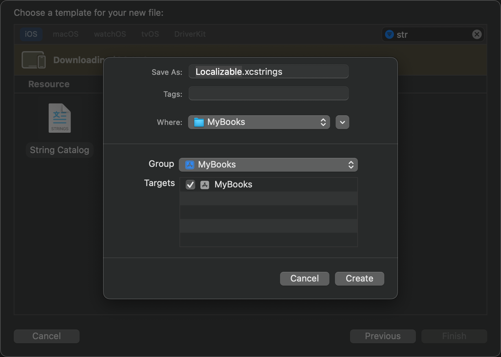
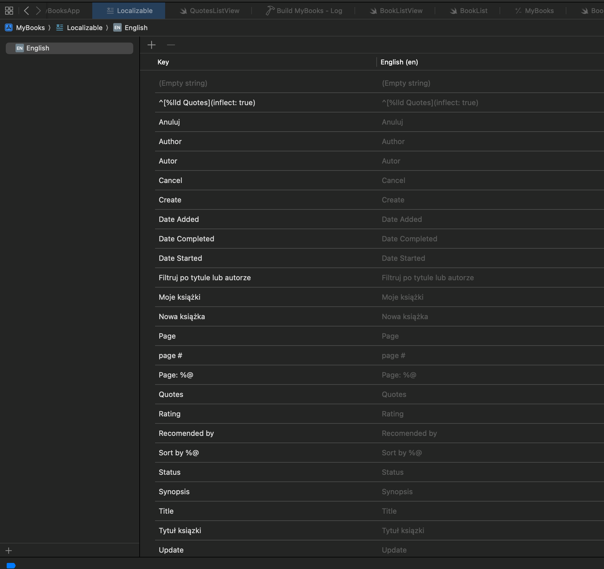

Lokalizowanie wersji


> 

Cześć, nazywam się Stuart Lynch. Lokalizowanie Twoich aplikacji w Xcode 15 stało się o wiele łatwiejsze dzięki katalogom ciągów znaków. Mimo że jest to siódme wideo w mojej serii Swift Data, tym razem nie będę omawiał żadnych funkcji Swift Data. Jeśli jesteś tutaj tylko dla lokalizacji, nie martw się. Możesz zostać ze mną, gdy lokalizuję moją aplikację na niemiecki i  polski. Bardzo chętnie poznam Twoją opinię, więc kliknij przycisk podoba mi się, jeśli podobało Ci się to wideo, i zostaw komentarz poniżej.  Chcę, aby mój był na najwyższym poziomie nawigacji, więc najpierw wybiorę tę aplikację, a następnie wybiorę Nowy plik z menu Plik. Możesz wyszukać "String" i wybrać Katalog ciągów znaków. Możesz pozostawić nazwę jako Localizable XC Strings. To utworzy plik źródłowy dla Twojego domyślnego języka, który w moim przypadku jest angielski. 



Następnie zbuduj swoją aplikację, a program wyodrębni ciągi znaków z Twojego projektu i wygeneruje źródło. 



Klucze powinny być identyczne dla ciągów znaków w kolumnie angielskiej. Niestety tutaj klucze mamy takie jak powpisywałem w interfejsie - wniosek, interfejs domyślnie najlepiej robic po angielsku, jeden język mamy wtedy z głowy.Tym sie zajmę teraz.  


Dodatkowo, z doświadczenia wiem, że ta jedna fajna rzecz, którą zrobiłem w wcześniejszej wersji, aby dostarczyć liczby mnogiej dla cytowanego ciągu znaków, nie współgra z lokalizacją. Ale dobra wiadomość jest taka, że jest to bardzo łatwe do naprawienia.I to wszystko dotyczące metody inflect tutaj, która została wygenerowana. Przejdź do widoku Edytuj Książkę i zmień etykietę z użyciem inflect na ciąg, który po prostu używa interpolacji ciągu znaków z liczby całkowitej count, a następnie znaków cudzysłowu. 

```swift
 Label("^[\(count) Quotes](inflect: true)",systemImage:"quote.opening")
```

zamieniamy na 

```swift
Label("\(count) Quotes",systemImage:"quote.opening")
```

Pozwól mi zbudować jeszcze raz, a kiedy wrócę do mojego katalogu ciągów znaków, zostanie zaktualizowany. Widzę teraz, że ten ciąg to teraz %lld cytowań, gdzie %lld będzie wartością count, a następnie znakiem cudzysłowu. Ale chcę, żeby ten ciąg był po prostu pojedynczym cytatem, gdy jest tylko jeden cytat. Cóż, możesz kliknąć prawym przyciskiem myszy i wybrać opcję vary by plural (zmień w zależności od liczby mnogiej). To generuje te dwie linie. A jeśli jest tylko jeden, chcę, żeby słowo było po prostu "quote". Dla pozostałych, które obejmują zero i każdą większą niż jedna liczbę, "quotes" są odpowiednie. Tak więc możemy to zostawić. Upewnijmy się tylko, że to działa. Mogę otworzyć widok Listy Książek, aby zobaczyć podgląd. Niech wybiorę jedną z moich książek i widzę, że ma zero cytowań używając liczby mnogiej. Jeśli kliknę przycisk, aby dodać cytat, mogę to zrobić tutaj. Następnie wróćmy do widoku Listy i widzę, że teraz pokazuje tylko jeden cytat, używając pojedynczego cytatu. Wróćmy znów do widoku Cytatów i dodajmy kolejny. Kiedy wrócę do widoku Listy, jest znowu liczba mnoga. Tak więc, jeśli nic innego, lokalizacja jest świetnym sposobem na radzenie sobie z liczbami mnogimi w Twojej aplikacji. Teraz przyszedł czas, aby dodać nowy język. Wybierz swój katalog ciągów znaków, a na dole możesz kliknąć przycisk plus i wybrać inny język. Wybieram niemiecki. Teraz, jeśli przejdę do pliku niemieckiego, widzę, że mamy klucz, a potem domyślną lokalizację, która jest angielska, a następnie kolumnę do wprowadzenia tłumaczenia na niemiecki.

> 

Zauważ, że niemiecki jest obecnie oznaczony jako 0% ukończony. Znajdźmy teraz ten fragment dotyczący cytowań, który poprawiliśmy dla angielskiego. Jeśli go rozwinę, mogę skopiować z wersji angielskiej, aby uzyskać poprawną zmienną, a następnie zmienić "quote" na odpowiednik w języku niemieckim, który brzmi Z-I-N-A-T dla liczby pojedynczej. Dla liczby mnogiej wystarczy dodać "E". Mogę oczywiście próbować przetłumaczyć każdy z tych ciągów samodzielnie, ale moja znajomość niemieckiego jest dosyć ograniczona, więc chcę zobaczyć, czy ChatGPT może mi pomóc. Jeśli kliknę prawym przyciskiem myszy na katalog ciągów znaków, mogę otworzyć go jako kod źródłowy. Widzę, że to jest plik JSON, a na górze widzę, że JSON dla tłumaczenia naszego ciągu znaków, który określa ilość cytatów, został już wykonany. Ale dla reszty tutaj na dole mam klucze bez wartości. Chcę skopiować wszystkie te pary klucz-wartość, począwszy od "author" aż do ostatniej pozycji. Ale chcę mieć tylko klucze, bez cudzysłowów i nawiasów. Mogę to skopiować i wkleić do edytora tekstu, a następnie ręcznie usunąć wszystkie zbędne ciągi znaków, włączając w to cudzysłowy, ale to jest żmudne. Jeśli mam wiele ciągów, zajmie mi to sporo czasu. Dlatego stworzyłem bardzo prosty plac zabaw, i zostawię link do gista, jeśli chcesz go skopiować. Po prostu sprawdź opis poniżej. Teraz muszę tylko wkleić skopiowane pary klucz-wartość tutaj do ciągu znaków kluczowych. Mam obliczeniową właściwość, która usunie nawiasy, cudzysłowy, przecinki i dodatkowe spacje. Nie jest to zbyt eleganckie, ale zajęło mi to tylko minutę. Jeśli uruchomię ten plac zabaw, zobaczysz, że otrzymam listę ciągów znaków, które mogę przesłać do ChatGPT. Pozwól mi skopiować tę listę. Teraz używam aplikacji MacGPT autorstwa Jordy'ego Bruhna, także zostawię link do niej w opisie. Chcę sformułować pytanie dotyczące tłumaczenia, więc powiedzę ChatGPT, aby przetłumaczył następującą listę ciągów znaków dla aplikacji iOS na język niemiecki. Następnie podaj wynik z angielskimi słowami, myślnikiem, a następnie niemieckim odpowiednikiem. Mogę wkleić moje skopiowane słowa. Teraz, gdy wykonam to polecenie, ChatGPT zrobi swoje i poda mi tłumaczenia na niemiecki.

> 

Tak więc mogę użyć tych tłumaczeń, aby uzupełnić niemiecki w moim katalogu ciągów znaków. Pozwól mi wrócić do widoku według katalogu ciągów znaków zamiast tego JSON źródłowego. Mogę posortować, klikając w nagłówek kolumny. Puste ciągi znaków są takie same w każdym języku, więc mogę je oznaczyć jako zrecenzowane, co zmienia je na znaczek zatwierdzenia. Zauważ znaczek zatwierdzenia pokazany dla naszych cytatów. Został ukończony i zatwierdzony. Zaczynajmy więc wprowadzać nasze inne tłumaczenia. Więc dla "Author", czyli "AUTOR" w języku angielskim, ChatGPT mówi mi, że w niemieckim to po prostu "AUTOR". Teraz nie będę Cię nudził wprowadzaniem reszty tych tłumaczeń, więc pozwól mi przejść od razu na koniec. Wróćmy więc do widoku Listy Książek i dodajmy drugi podgląd dla niemieckiego. Najpierw dodajmy tytuł dla tego podglądu jako "English", aby pojawił się w naszym podglądzie. Teraz mogę skopiować cały ten podgląd i wkleić go, nadając tytuł "German". Cóż, teraz nadal są po angielsku. Co mogę zrobić, to dodać metodę środowiskową do naszego widoku, która używa ścieżki klucza, która to jest lokalizacja, ale wymaga wartości, a jest nią instancja lokalizacji z identyfikatorem dla niemieckiego, który to jest DE. Teraz, jeśli przejdę do tego podglądu, zobaczysz, że mój tytuł i pola wyszukiwania zostały zmodyfikowane. Ale jeśli przyjrzysz się uważnie temu pickerowi, te małe litery "status", "title" i "author" nie zostały przetłumaczone. Teraz, jeśli przejdę do widoku szczegółów, większość ciągów znaków została przetłumaczona, za wyjątkiem tych, które wprowadziłem, oczywiście, ponieważ moje wpisy do książek utworzyłem po angielsku. Ale picker również nie został przetłumaczony, a jest to coś, co jest w kodzie. Problem polega na tym, że używaliśmy enumów, enumów case iterable i korzystaliśmy zarówno ze string raw value, jak w przypadku sort order, jak i z właściwości obliczeniowej dla opisu ciągu znaków w naszym enumie statusu. To jest naprawdę łatwe do naprawienia. Możesz znaleźć sort order w widoku listy książek.

> 

I wszystko, co musimy zrobić, to zmienić typ enuma z ciągu znaków na zasób z lokalizowanym ciągiem znaków. Jeśli zlokalizujemy enum statusu, znajduje się w pliku modelu książki, możemy zmienić tę właściwość obliczeniową description z typu string na zasób z lokalizowanym ciągiem znaków. Pozwól mi zbudować moją aplikację jeszcze raz, żeby sprawdzić, czy generuje więcej ciągów znaków dla mojego katalogu ciągów znaków. Teraz widzę, że mamy tylko 84% ukończenia dla naszego niemieckiego, z wieloma nowymi pozycjami czekającymi na tłumaczenie. Cóż, naiwnie, po prostu użyję "autor" z małej litery dla małej litery "author". Chociaż, co ja tam wiem? Zrobię to samo ze "status" i "name" i użyję ChatGPT, żeby dokończyć tłumaczenia dla mnie dla tych innych słów. Znowu nie będę marnować twojego czasu. Po ukończeniu widzę zielone światło, żeby iść do przodu. Jeśli teraz sprawdzę mój podgląd, wygląda dobrze w obu pickerach. A gdy przechodzę do innych ekranów, widzę, że wszystkie ciągi znaków zostały przetłumaczone. Wygląda to naprawdę dobrze, ale jeśli nie jesteś native speakerem w tym języku, który tłumaczysz, gorąco polecam znalezienie kogoś, kto mówi w tym języku, aby zweryfikować twoje tłumaczenia. Możesz to zrobić, eksportując swój katalog i przesyłając go komuś innemu. Z menu produktu wybierz eksport lokalizacji. Następnie wybierz języki, które chcesz wyeksportować. Angielski będzie zawsze zaznaczony, jeśli to jest twój główny język, ale możesz mieć ich więcej niż jeden.


Na przykład, możesz przeprowadzać lokalizację dla francuskiego lub innego języka. Ale ja mam tylko niemiecki, więc generuje folder z angielskim i wybranym językiem. Te pliki można otworzyć bezpośrednio w Xcode przez każdego posiadającego Xcode 15. Nie potrzebują całego twojego projektu. Więc mogę spakować te pliki i przesłać je osobie, która zna ten język. Miałem szczęście, że Mark Lutke i Tom Ludwig zgodzili się sprawdzić to dla mnie. Oczywiście pojawiły się pewne problemy. Po ich zwrocie sprawdziłem je i dokonałem kilku wyborów na podstawie różnic, które mieli, i skonsolidowałem je w jeden plik. Teraz mogę wrócić do menu produktu i tym razem wybrać importowanie lokalizacji. Wybiorę ten plik. Różnice pokazują mi wszystkie edycje. Na przykład rzeczowniki są zapisywane z wielkiej litery w niemieckim, więc nie ma "auto-r" z małej litery. Istnieje również inny plik, który został zaimportowany do pliku info.plist. Tutaj określona jest nazwa mojej aplikacji i przetłumaczona. Pozwól mi zaimportować i zaktualizować moje ciągi znaków. Teraz widzę, że mam dwa pliki lokalizacyjne tutaj i ten dodatkowy dla info.plist. Ten fragment jest całkowicie opcjonalny, ale dla tych z was, którzy śledzą moją serię Swift Data, chcę dodać ikonę i ekran startowy do mojej aplikacji. Udostępniłem dwa obrazy, które można pobrać z linku w opisie. Jeden jest dla ikony aplikacji, a drugi dla ekranu startowego.


Upewnij się, że wybrano swój folder z zasobami, a następnie przeciągnij plik PNG o rozmiarze 1024 pikseli na pole ikony aplikacji. Następnie przeciągnij plik PNG ekranu startowego do folderu z zasobami. Będziemy go używać jako naszego ekranu startowego. Teraz utwórz nowy plik i wyszukaj "launch screen". Pozostaw nazwę i dodaj go do swojego projektu. Wybierz ten plik. Kiedy storyboard się otworzy, zaznacz pole tekstowe i usuń je. Następnie naciśnij przycisk plus, przejdź do karty obrazu i zlokalizuj swój obraz ekranu startowego, a następnie przeciągnij go na storyboard. Następnie możesz wybrać obraz i zastosować ograniczenia poziome i pionowe. To jest jedyna część storyboardu, którą robię, ponieważ nie ufam opcji plist dla ekranu startowego, aby była niezawodna. I na koniec wybieramy aplikację i wybieramy storyboard ekranu startowego. W momencie tworzenia tego filmu istniał problem z symulatorem iPhone'a 15 Pro, ponieważ nie mogłem uzyskać dostępu do aplikacji Ustawienia na symulatorze. Po prostu nie chciała się uruchomić. Chciałem móc zmienić język, żeby zobaczyć, jak to działa na symulatorze. Pozwól mi uruchomić to na iPhone'u 15. Widzę ekran startowy. I ponieważ to jest zupełnie nowy start na nowym urządzeniu, nie ma wprowadzonych żadnych książek i widzę zawartość dostępnego widoku, która pokazuje angielski, jako że to jest mój wybrany język na symulatorze. Pozwól mi wrócić do ekranu głównego i otworzyć aplikację Ustawienia, a następnie przejść do sekcji Ogólne. Tutaj mogę wybrać język i region. Jeśli wybiorę język, mogę wybrać i wybrać inny język, na przykład niemiecki.

Następnie, gdy zostanę zapytany, wybiorę go. Mogę także zmienić i wybrać inny region, co wpłynie na formaty daty i liczby oraz formaty waluty, ale nie muszę tego robić tutaj. Jeśli teraz wyjdę z powrotem na ekran główny, zauważę, że aplikacja Książki jest tutaj i nadal pokazuje angielski tytuł, ale zaraz to naprawię. Kiedy jednak uruchomię aplikację, wszystkie ciągi znaków są teraz po niemiecku. Pozwól mi dodać niemiecką książkę. Zauważ, że wszystkie ciągi znaków są po niemiecku, co jest oczekiwane. Kiedy przechodzę do innych ekranów, widzimy, że wszystko jest po niemiecku, jak można było się spodziewać. Jest jedna rzecz, którą muszę jeszcze naprawić, a jest nią nazwa aplikacji. Rozwiązaniem jest powrót do twojego projektu i zmiana nazwy tego pliku `mybooks-info.plist.xcstrings` na po prostu `info.plist.xcstrings`. Otrzymaliśmy to w wyniku importu, ale jeśli wykonujesz własne lokalizacje, możesz po prostu utworzyć inny katalog ciągów znaków i nazwać go `info.plist.xcstrings`. Pozwól mi uruchomić aplikację jeszcze raz. Po uruchomieniu, wyjdę na pulpit, a teraz widzę, że jest po niemiecku. Ale sprawdzę, czy to nie zmieniło się na stałe, więc wrócę do ustawień i przełączę się z powrotem na angielski. Jeśli wrócę na pulpit, zobaczę, że tytuł i nazwa aplikacji wróciły do angielskiego. No i to wszystko na ten film. Mam nadzieję, że nauczyłeś się tutaj czegoś użytecznego, co możesz zastosować w swoich własnych projektach. Jeśli spodobał Ci się ten film, daj mu kciuka w górę i zostaw komentarz.

> Hi, my name is Stuart Lynch. Localizing your apps in Xcode 15 has become so much easier with string catalogs. Even though this is the seventh video in my Swift data series, I won't be covering any Swift data functions here. So if you're here just for localizations, then fear not. You can stay with me as I localize my app to German. I'd love getting your feedback, so tap the thumbs up button if you enjoyed this video and leave a comment below. Make sure you subscribe to the video and ring that bell to get notifications of new videos. And if you want to support my work, you can buy me a coffee. If you're continuing on with me and the Swift data series, you can continue on where we left off in video six. If you're just joining me for this video here, you can download that branch from the GitHub repository from the link in the description. Make sure you choose the branch that is the sixth video, Many Team, Many Relationships branch. To begin your localization journey, you need to create a localization file. I want mine to be at the top level of my navigation, so I'm going to select that app first and then choose New File from the File menu. You can search for String and select String Catalog. You can leave the name as Localizable XC Strings. This will create a source file for your default language, which in my case is English. Next, build your app and it will extract the strings from your project and generate the source. We can see that the keys are identical for the strings in the English column here in this English file. Well, from experience, I found that this one cool thing that I did in an earlier version to provide plurals for the string quote doesn't play well with localization. But the good news is that it's super easy to fix. 


> And that's that inflect method here that was generated. So go to the Edit Book view and change the label from using the inflect to a string that simply uses the string interpolation of the count integer followed by the string quotes. Let me build one more time and when I return to my string catalog, it's been updated. I can see that that string is now %lld quotes where that %lld will be the count value followed by the string quotes. But I want that string to be just quote singular when there's only one quote. Well, what you can do is you can right click and choose vary by plural. This generates those two lines. And if there is only one, I want the word to be just quote. For the other, which includes zero and any number greater than one, quotes is fine. So we can leave that. So let's just make sure that this works. I can open the Book List view to display the preview. Let me select one of my books and I see that it has zero quotes using the plural. If I tap on the button to add a quote, I can do that here. Then let me return to List view and I see that it now shows just one quote using the singular quote. Let me return to the Quotes view again and add another one. When I return to the List view, it's plural again. So if for nothing else, localization is a great way to deal with plurals in your application. Well, now it's time to add a new language. Select your string catalog and from the bottom you can click on the plus button and select another language. I'm going to choose German. Now if I go to the German file, I can see that we have the key followed by the default localization, which is English, and then a column to provide the German translation. 


> And notice that the German is currently marked as 0% complete. So let me find that one for quotes that we fixed up for English. If I expand it, I can copy from the English version so that I get the variable correct and then change quote to the German equivalent, which is Z-I-N-A-T for singular. For the plural, I just have to add an E. Now I could go through and try and translate each one of these by myself, but my knowledge of German is fairly limited, so I want to see if ChatGPT can help me out. If I right-click on the string catalog, I can open it as source code. I see it's a JSON file and up at the top, I see that the JSON for translating our count of quotes string has been done. But for the rest down here, I have keys with no values. What I want to do is to copy all these key-value pairs, starting at author right down to the last one. But all I want is the keys and no quotes and no brackets. So what I can do is I can take this and paste this copy text into a text editor and then manually remove all the extraneous strings, including the quotes, but this is tedious. And if I have a lot, then that will take some time. So what I did was create a very simple playground, and I'll leave a link for a gist if you want to recreate it. Just check the description below. Now what I just have to do here is paste in that copied key-value pairs into the keywords string here. And I have a computed property that will strip out the brackets, the quotes, the commas, and the extra spaces. Now this isn't very elegant, but it only took me a minute to do. If I run the playground, you'll see I get that list of strings that I can submit to chatGPT. So let me copy this list. Now I use the app MacGPT by Jordy Bruhn, and I'll leave a link to that in the description as well. I want to make this question for translation, so I'm going to tell chatGPT to translate the following list of strings for an iOS application into German. And then provide the result with the English words followed by a dash, and then the German equivalent. And then I can paste in my copied set of words. Now when I execute this command, chatGPT does its thing and provides me with German translations. 
>
> 


> So I can use these then to complete my German in my string catalog. So let me switch back to View by String Catalog instead of this JSON source. And I can sort by tapping on the column header. Now an empty string is an empty string in any language, so I can mark it as being reviewed, and this changes it to a checkmark. Notice the checkmark shown for our quotes. It's been completed and reviewed. So let's start to enter our other translations. So for Author, capital AUTOR in English, chatGPT tells me in German it's just AUTOR. Now I won't bore you with me typing in the rest of these, so let me just skip to the end here. Well let me return to our Booklist view then and add a second preview for German. First let me add a title for this one as English so that it shows up in our preview. Now I can copy this whole preview and paste it in and provide a title of German. Well if they're still English right now. What I can do is add an environment method to our view that uses a key path, which is locale, but it requires a value, and that's the locale instance with the identifier for German which is capital DE. Now if I go to this preview you'll see that my title and search fields have been modified. But if I look closely at this picker, these lowercase status, title, and author haven't been translated. Now if I go to the detail view, most of the strings have been translated except for the ones that were entered by me, of course, because I created my book entries in English. But the picker also has not been translated either, and that's something that is in code. And the problem is that we have used enums and case iterable enums and used either a string raw value, like from sort order, or a computed property for the string description in our status enum. Well this is really easy to fix. You can find sort order in the book list view. 


> And all we have to do is change the enum type from string to localized string resource. And if we locate the status enum, it's in the book model file, we can change that description computed property from being a string to a localized string resource. So let me build my app once more to see if it generates more strings for our string catalog. I can see now that we only have 84% completion for our German with a number of new items waiting for translation. Well naively, let me just use lowercase autor for the lowercase author. I mean, what do I know? And I'm going to do the same with status and name and use chat gpt to complete the translations for me for those other words. Again I'm not going to waste your time. Once completed, I see I have a green light to go ahead. If I check my preview now, it looks good in both pickers. And when I go to other screens, I see that all the strings have been translated. This all looks really good, but if you're not a native speaker in that language you're translating, I highly recommend that you find someone who does speak the language to verify your translations. And you can do this by exporting your catalog and sending it to someone else. From the product menu, choose export localization. And then choose the languages that you want to export. English will always be selected if that's your primary language, but you may have more than one. 


> For example, you may be localizing for French or some other language as well. But I only have German, and so it generates a folder with the English and the selected language. And these files can be opened directly in Xcode by anyone with Xcode 15. They don't need your entire project. So I can zip up these files and send them to someone who knows the language. I was fortunate enough to have Mark Lutke and Tom Ludwig volunteer to check these out for me. And of course, there were some problems. Once I got them back, I checked them out and made a couple of choices based on variations that they had and consolidated them into a single file. But now I can go back to the product menu and this time choose import localizations. And I'll choose that file. The diff is showing me all of the edits. Like nouns are capitalized in German, so no lowercase auto-r. And then there's another file that was also imported for the info.plist. And that's where my app name has been specified and translated to. So let me import and update my strings. I see now I have two localization files here and this extra one here for the info.plist. This part here is totally optional, but for those of you who are following my Swift data series, I want to add an icon and a launch screen to my app. I provided two images that can be downloaded from the link in the description. One is for the app icon and the other for the launch screen. 


> So make sure you've got your asset folder selected and then drag the App Store 1024 PNG onto the app icon placeholder. Then drag the launch screen PNG into the asset folder. And we're going to use that for our launch screen. So create a new file and search for launch screen. Leave the name and add it to your project. Select the file. And then when the storyboard opens, select the text field here and delete it. Then tap on the plus button and go to the image tab and locate and find your launch screen image and drag it onto the storyboard. You can then select the image and apply horizontal and vertical constraints. Now this is the only storyboard stuff I do anymore because I don't trust the plist launch screen option to be reliable. And finally we select the app and choose the launch screen storyboard. Now at the time of this creation of this video, there was a problem with the iPhone 15 Pro simulator in that I couldn't access the settings app on the simulator. It simply just wouldn't open. And I want to be able to change my language to see how this works on the simulator. So let me run this on an iPhone 15. I see the launch screen. And because this is a brand new launch on a new device, no books are entered and I get that content on available view showing the English as that's my chosen simulator language. So let me exit back to the home screen and open the settings app and go to the general section. Here I can choose language and region. If I choose the language, I can select and choose another language like German. 


> And then when asked, I'll choose it. I could also change and choose a different region and that would affect the date and number formats and currency formats, but I don't need to do that for here. If I exit back now to the home screen, I'll notice that the books app is here and it's still showing the English title, but I'll fix that shortly. When I launched the app though, all the strings are now in German. So let me add a German book. Notice all the strings are in German as expected. When I get to other screens, we see it's all in German as we would expect. There's that one thing I have to fix though, and that's the name of the application. Well the solution is to return to your project and rename this mybooks-info plist.xcstrings to simply be info plist.xcstrings. And we got this as a result of an import, but if you're just doing your own localizations, you can create another string catalog and just call it info plist.xcstrings. Well let me run the app one more time then. After launch, let me exit to the desktop and now I see it's in German. But let me verify that it hasn't changed permanently, so I'm going to return to the settings and switch back to English. If I return back to the desktop, we'll see the title and the name of the app is back in English. Well that's it for this video. I hope you learned something useful here that you can use in your own projects. If you liked this video, please give it a thumbs up and leave me a comment.